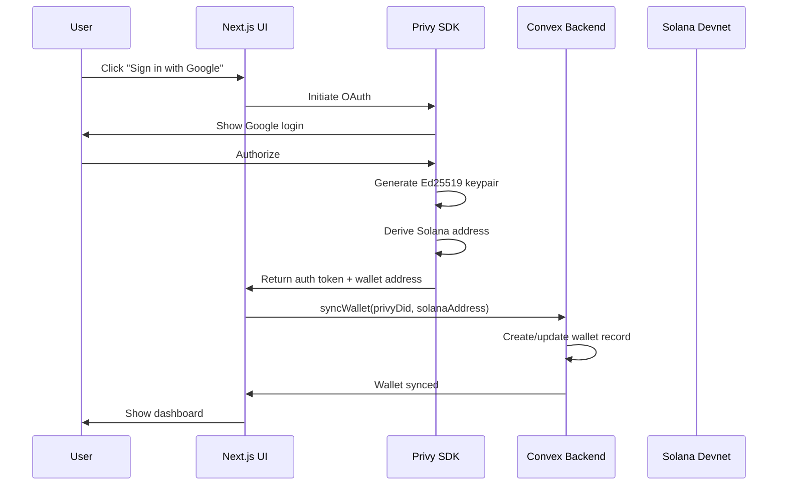
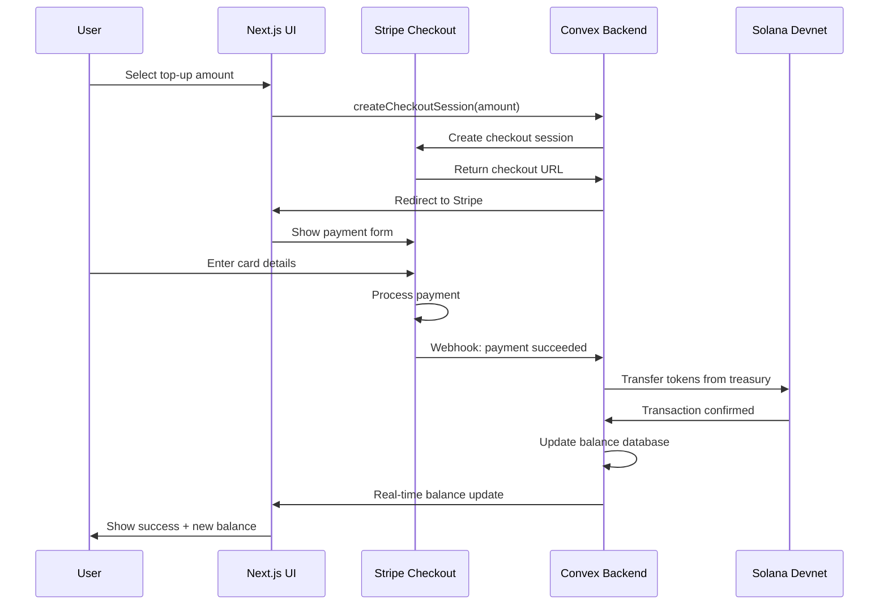
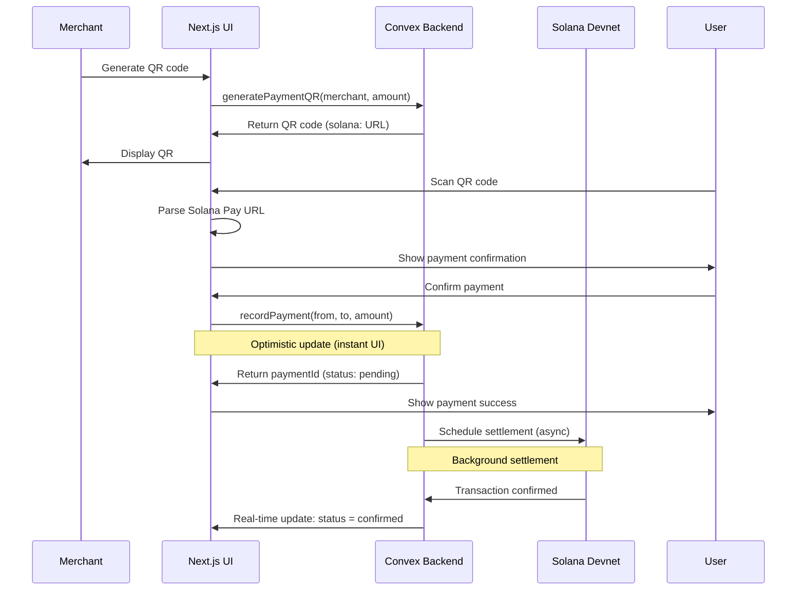
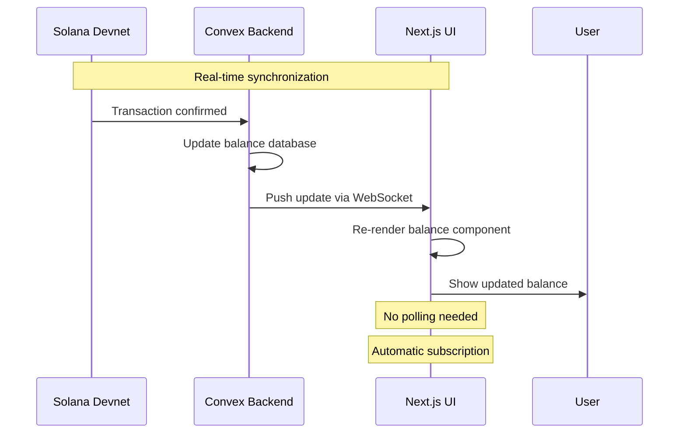
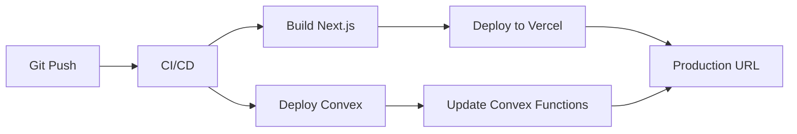

# Architecture: High-Frequency Event Payment PWA

**Project:** Digital Currency Wallet with Ledger Technology (DCWLT) - PWA Edition
**Research Date:** 2026-01-16
**Architecture Type:** Hybrid Ledger (On-Chain Settlement + Off-Chain Execution)
**Target Scale:** 20,000 concurrent users in 15-minute windows

---

## Executive Summary

This architecture documents a **Progressive Web Application (PWA)** for high-frequency event payments using a **Hybrid Ledger** approach. The system combines the security of Solana blockchain settlement with the speed of Convex real-time database to handle "thundering herd" scenarios (e.g., stadium halftime rushes).

**Core Innovation:** Separation of **execution** (off-chain in Convex, <200ms) from **settlement** (on-chain in Solana, ~400ms). This enables instant UI feedback while maintaining blockchain security guarantees.

**Key Technologies:**
- **Frontend:** Next.js 16+ (App Router) + PWA manifest + Shadcn/UI
- **Real-Time Backend:** Convex (stateful sync platform with optimistic updates)
- **Authentication:** Privy (embedded wallet with social login)
- **Payments:** Stripe Checkout (fiat on-ramp)
- **Blockchain:** Solana Devnet (SPL tokens via Helius RPC)

---

## 1. Component Boundaries

### 1.1 Frontend Layer (Next.js 16 PWA)

**Responsibility:** User interface, PWA capabilities, client-side state

**Location:** `/` (Next.js app root)

**Key Components:**

| Component | Purpose | Technology |
|-----------|---------|------------|
| App Router | Server-side routing, React Server Components | Next.js 16 |
| PWA Manifest | Installability, offline capability | @ducanh2912/next-pwa |
| Service Worker | Asset caching, background sync | Workbox |
| UI Components | Reusable interface elements | Shadcn/UI + Tailwind |
| Privy Provider | Embedded wallet injection | @privy-io/react-auth |
| Convex Provider | Real-time state subscriptions | convex/react-client |

**Boundaries:**
- **OWNS:** UI state (modals, transitions), form validation, PWA lifecycle
- **DOES NOT OWN:** Business logic, transaction signing, balance calculations
- **COMMUNICATES:** Via Convex subscriptions (read) and mutations (write)

**File Structure:**
```
app/
├── (auth)/
│   ├── login/
│   │   └── page.tsx           # Social login UI
│   └── layout.tsx             # Auth wrapper
├── (dashboard)/
│   ├── dashboard/
│   │   └── page.tsx           # Main wallet interface
│   ├── topup/
│   │   └── page.tsx           # Stripe checkout flow
│   └── layout.tsx             # Protected route wrapper
├── (payment)/
│   ├── scan/
│   │   └── page.tsx           # QR code scanner
│   └── confirm/
│       └── page.tsx           # Payment confirmation
├── layout.tsx                 # Root layout (providers)
└── page.tsx                   # Landing/home
components/
├── ui/                        # Shadcn components
├── wallet/
│   ├── BalanceDisplay.tsx     # Real-time balance
│   ├── TransactionList.tsx    # Payment history
│   └── QRScanner.tsx          # Camera-based scanner
└── providers/
    ├── ConvexProvider.tsx     # Convex client setup
    └── PrivyProvider.tsx      # Privy auth setup
```

---

### 1.2 Real-Time Backend Layer (Convex)

**Responsibility:** Business logic, data persistence, real-time sync, blockchain orchestration

**Location:** `/convex/` (colocated with Next.js)

**Key Components:**

| Component | Purpose | Type |
|-----------|---------|------|
| Schema | Database schema definition | TypeScript |
| Queries | Read operations, auto-subscribed | Convex Query Functions |
| Mutations | Write operations, optimistic updates | Convex Mutation Functions |
| Actions | Server-side operations (no optimistic updates) | Convex Action Functions |
| Stripe Component | Webhook processing, payment intents | @convex-dev/stripe |

**Boundaries:**
- **OWNS:** Business logic, data consistency, blockchain transaction orchestration, Stripe integration
- **DOES NOT OWN:** UI rendering, client-side caching (handled automatically)
- **COMMUNICATES:** Via WebSocket (auto-managed), HTTP API (for external webhooks)

**Critical Distinction (Queries vs Mutations vs Actions):**

```typescript
// QUERY: Read-only, auto-subscribed, runs on all servers
// Use: Fetching data that updates in real-time
export const getBalance = query({
  args: { walletAddress: v.string() },
  handler: async (ctx, args) => {
    const balance = await ctx.db
      .query("balances")
      .withIndex("by_wallet", q => q.eq("walletAddress", args.walletAddress))
      .unique();
    return balance?.amount ?? 0;
  }
});

// MUTATION: Write with optimistic update, runs on all servers
// Use: User-initiated writes that need instant UI feedback
export const recordPayment = mutation({
  args: {
    fromWallet: v.string(),
    toWallet: v.string(),
    amount: v.number(),
  },
  handler: async (ctx, args) => {
    // Optimistic update: UI updates immediately
    const paymentId = await ctx.db.insert("payments", {
      ...args,
      status: "pending",
      timestamp: Date.now(),
    });

    // Trigger async settlement (doesn't block UI)
    await ctx.scheduler.runAfter(0, internal.blockchain.settlePayment, {
      paymentId,
      ...args,
    });

    return paymentId;
  }
});

// ACTION: Server-only, no optimistic update
// Use: Secret operations, heavy computation, external API calls
export const executeTopup = action({
  args: {
    walletAddress: v.string(),
    amount: v.number(),
    stripePaymentIntentId: v.string(),
  },
  handler: async (ctx, args) => {
    // Verify Stripe payment
    const payment = await stripe.paymentIntents.retrieve(args.stripePaymentIntentId);
    if (payment.status !== "succeeded") {
      throw new Error("Payment not successful");
    }

    // Execute blockchain transaction (server-side)
    const signature = await transferTokensFromTreasury(args.walletAddress, args.amount);

    // Update database
    await ctx.runMutation(internal.balances.credit, {
      walletAddress: args.walletAddress,
      amount: args.amount,
      signature,
    });

    return { success: true, signature };
  }
});
```

**File Structure:**
```
convex/
├── schema.ts                  # Database schema
├── types.ts                   # Shared TypeScript types
├── preloads.ts                # Data preloading strategy
├── auth/
│   └── privy.ts               # Privy authentication
├── balances/
│   ├── queries.ts             # Balance reads
│   ├── mutations.ts           # Balance writes
│   └── index.ts               # Exports
├── payments/
│   ├── queries.ts             # Payment history
│   ├── mutations.ts           # Payment recording
│   └── index.ts
├── blockchain/
│   ├── actions.ts             # On-chain settlement
│   ├── solana.ts              # RPC client wrapper
│   └── index.ts
├── stripe/
│   ├── actions.ts             # Stripe webhook handling
│   ├── topup.ts               # Top-up orchestration
│   └── index.ts
└── merchants/
    ├── queries.ts             # Merchant data
    └── mutations.ts           # QR generation
```

**Database Schema:**

```typescript
// convex/schema.ts
export default defineSchema({
  // User wallets (linked to Privy)
  wallets: defineTable({
    privyDid: v.string(),              // Privy decentralized ID
    solanaAddress: v.string(),         // Derived Solana address
    createdAt: v.number(),
    lastLogin: v.optional(v.number()),
  })
    .index("by_privy", ["privyDid"])
    .index("by_solana", ["solanaAddress"]),

  // Token balances (off-chain cache)
  balances: defineTable({
    walletAddress: v.string(),
    amount: v.number(),                // Cached balance
    lastUpdated: v.number(),           // Timestamp
    pendingTransactions: v.array(v.id("transactions")), // Locking
  })
    .index("by_wallet", ["walletAddress"]),

  // Payment records
  transactions: defineTable({
    fromWallet: v.string(),
    toWallet: v.string(),
    amount: v.number(),
    status: v.string(),                // "pending" | "confirmed" | "failed"
    signature: v.optional(v.string()),  // On-chain signature
    createdAt: v.number(),
    settledAt: v.optional(v.number()),
  })
    .index("by_from", ["fromWallet"])
    .index("by_to", ["toWallet"])
    .index("by_status", ["status"]),

  // Top-up records
  topups: defineTable({
    walletAddress: v.string(),
    amount: v.number(),
    stripePaymentIntentId: v.string(),
    status: v.string(),                // "pending" | "completed"
    signature: v.optional(v.string()),
    createdAt: v.number(),
  })
    .index("by_wallet", ["walletAddress"])
    .index("by_stripe", ["stripePaymentIntentId"]),

  // Merchant profiles
  merchants: defineTable({
    name: v.string(),
    solanaAddress: v.string(),
    category: v.string(),              // "bar" | "merch" | "food"
    isActive: v.boolean(),
  })
    .index("by_address", ["solanaAddress"])
    .index("by_active", ["isActive"]),
});
```

---

### 1.3 Authentication Layer (Privy)

**Responsibility:** Identity, wallet generation, key management

**Technology:** Privy Embedded Wallet

**Location:** Client-side (browser) + Server-side (Convex actions)

**Key Components:**

| Component | Purpose | Security |
|-----------|---------|----------|
| Privy Auth | Social login (Google, Apple) | OAuth 2.0 |
| Key Generation | Ed25519 keypair creation | Shamir's Secret Sharing |
| Wallet Derivation | Solana address from private key | Client-side, non-custodial |
| Session Management | JWT token handling | HTTP-only cookies |

**Boundaries:**
- **OWNS:** User identity, private key storage, social auth flow
- **DOES NOT OWN:** Balance data, transaction history (stored in Convex)
- **COMMUNICATES:** Via Privy SDK (client) and webhook callbacks (server)

**Authentication Flow:**

```typescript
// components/providers/PrivyProvider.tsx
import { PrivyProvider } from '@privy-io/react-auth';

export function Providers({ children }) {
  return (
    <PrivyProvider
      appId={process.env.NEXT_PUBLIC_PRIVY_APP_ID}
      config={{
        // Specify Solana support
        embeddedWallets: {
          createOnLogin: 'users-without-wallets',
        },
        // Social login providers
        appearance: {
          theme: 'light',
          accentColor: '#6366f1',
        },
      }}
    >
      {children}
    </PrivyProvider>
  );
}
```

**Wallet Derivation:**

```typescript
// After successful Privy login
import { usePrivy } from '@privy-io/react-auth';

function Dashboard() {
  const { ready, authenticated, user, getAccessToken } = usePrivy();

  useEffect(() => {
    if (authenticated && user) {
      // Get embedded wallet
      const wallet = user.linkedAccounts.find(
        account => account.type === 'wallet' && account.walletType === 'ethereum'
      );

      // Derive Solana address from Privy wallet
      const solanaAddress = deriveSolanaAddress(wallet.address);

      // Sync with Convex
      convex.mutation(auth.syncWallet, {
        privyDid: user.id,
        solanaAddress,
      });
    }
  }, [authenticated, user]);

  // ...
}
```

**Security Model:**
- Private keys split using Shamir's Secret Sharing (3-of-5)
- Shares distributed: User device, Privy cloud, recovery methods
- No single point of failure
- Non-custodial: User maintains control

---

### 1.4 Payment Layer (Stripe)

**Responsibility:** Fiat on-ramp, payment processing

**Technology:** Stripe Checkout + Convex Stripe Component

**Location:** Convex actions (server-side), Stripe checkout (client-side)

**Key Components:**

| Component | Purpose | Trigger |
|-----------|---------|---------|
| Checkout Session | Payment UI, card processing | User initiates top-up |
| Webhook Handler | Payment confirmation | Stripe → Convex |
| Top-up Orchestration | Token transfer on success | Webhook received |

**Boundaries:**
- **OWNS:** Payment collection, card validation, refunds
- **DOES NOT OWN:** Token balance (held in Convex), blockchain settlement
- **COMMUNICATES:** Via Stripe webhooks → Convex HTTP endpoint

**Integration Architecture:**

```typescript
// convex/stripe/topup.ts
import { action } from "./_generated/server";
import { v } from "convex/values";
import stripe from '@convex-dev/stripe/server';

export const createCheckoutSession = action({
  args: {
    amount: v.number(),  // USD amount
    tokenAmount: v.number(),  // Event tokens to receive
  },
  handler: async (ctx, args) => {
    const session = await stripe.checkout.sessions.create({
      payment_method_types: ['card'],
      line_items: [{
        price_data: {
          currency: 'usd',
          product_data: {
            name: 'Event Tokens',
            description: `${args.tokenAmount} Event Tokens`,
          },
          unit_amount: args.amount * 100,  // Convert to cents
        },
        quantity: 1,
      }],
      mode: 'payment',
      success_url: `${process.env.NEXT_PUBLIC_APP_URL}/topup/success?session_id={CHECKOUT_SESSION_ID}`,
      cancel_url: `${process.env.NEXT_PUBLIC_APP_URL}/topup/cancel`,
      metadata: {
        convexPaymentId: paymentId,
        walletAddress: userWallet,
      },
    });

    return { checkoutUrl: session.url };
  },
});
```

**Webhook Handling:**

```typescript
// convex/http.ts (Convex HTTP endpoint for webhooks)
import { httpRouter } from "convex/server";
import { Webhook } from "svix";
import stripe from '@convex-dev/stripe/server';

const router = httpRouter();

router.post("/stripe/webhook", async (request) => {
  const signature = request.headers.get("stripe-signature");
  const payload = await request.json();

  let event;
  try {
    event = stripe.webhooks.constructEvent(
      payload,
      signature,
      process.env.STRIPE_WEBHOOK_SECRET!
    );
  } catch (err) {
    return new Response("Invalid signature", { status: 400 });
  }

  switch (event.type) {
    case "checkout.session.completed":
      const session = event.data.object;
      await ctx.runMutation(internal.stripe.processSuccessfulPayment, {
        sessionId: session.id,
        walletAddress: session.metadata.walletAddress,
        amount: session.amount_total / 100,
      });
      break;

    case "checkout.session.expired":
      // Handle expired session
      break;
  }

  return new Response(null, { status: 200 });
});
```

---

### 1.5 Blockchain Layer (Solana)

**Responsibility:** Token settlement, ledger of truth

**Technology:** Solana Devnet, SPL Tokens, Helius RPC

**Location:** Convex actions (server-side only)

**Key Components:**

| Component | Purpose | Timing |
|-----------|---------|--------|
| Helius RPC | Dedicated RPC endpoints | ~400ms block time |
| SPL Token | Event currency standard | Mint: `4RGfPGKm8jntNg88mwNP3zHi2AxAzrVq68zDcLrSuKwq` |
| Treasury Wallet | Holds all Event Tokens | Server-side keypair |
| Jito Bundles | Transaction priority during congestion | Optional |

**Boundaries:**
- **OWNS:** Token transfers, balance verification, transaction finality
- **DOES NOT OWN:** UI updates (handled via Convex), payment processing (Stripe)
- **COMMUNICATES:** Via Convex actions (never expose private keys to client)

**Security Critical:** Treasury private key NEVER leaves server:

```typescript
// convex/blockchain/actions.ts
import { action } from "./_generated/server";
import { v } from "convex/values";
import { Connection, Keypair, Transaction } from "@solana/web3.js";
import { createTransferInstruction, getAccount } from "@solana/spl-token";

// Server-side only (never expose to client)
const TREASURY_KEYPAIR = Keypair.fromSecretKey(
  Uint8Array.from(JSON.parse(process.env.TREASURY_PRIVATE_KEY!))
);

export const transferTokensFromTreasury = action({
  args: {
    toWallet: v.string(),
    amount: v.number(),
  },
  handler: async (ctx, args) => {
    // Dedicated RPC for reliability
    const connection = new Connection(
      process.env.HELIUS_RPC_URL!,
      'confirmed'
    );

    // Get token accounts
    const treasuryATA = await getAccount(connection, TREASURY_KEYPAIR.publicKey);
    const userATA = await getOrCreateAssociatedTokenAccount(
      connection,
      TREASURY_KEYPAIR,
      new PublicKey(process.env.TOKEN_MINT_ADDRESS!),
      new PublicKey(args.toWallet)
    );

    // Create transfer instruction
    const instruction = createTransferInstruction(
      treasuryATA.address,     // Source
      userATA.address,         // Destination
      TREASURY_KEYPAIR.publicKey, // Authority
      args.amount * 1e9        // Convert to smallest unit (9 decimals)
    );

    // Build transaction
    const transaction = new Transaction().add(instruction);
    transaction.feePayer = TREASURY_KEYPAIR.publicKey;
    const { blockhash } = await connection.getLatestBlockhash();
    transaction.recentBlockhash = blockhash;
    transaction.sign(TREASURY_KEYPAIR);

    // Send transaction
    const signature = await connection.sendTransaction(transaction);

    // Confirm transaction
    await connection.confirmTransaction(signature);

    return { signature };
  },
});
```

**Hybrid Settlement Pattern:**

```typescript
// Off-chain execution (instant UI)
export const makePayment = mutation({
  args: {
    toWallet: v.string(),
    amount: v.number(),
  },
  handler: async (ctx, args) => {
    // 1. Optimistic update: UI shows success immediately
    const paymentId = await ctx.db.insert("transactions", {
      fromWallet: userWallet,
      toWallet: args.toWallet,
      amount: args.amount,
      status: "pending",  // Off-chain, awaiting settlement
      createdAt: Date.now(),
    });

    // 2. Update off-chain balance instantly
    await ctx.db.update(balanceRecord, {
      amount: currentBalance - args.amount,
    });

    // 3. Schedule on-chain settlement (async, doesn't block UI)
    await ctx.scheduler.runAfter(0, internal.blockchain.settlePayment, {
      paymentId,
      fromWallet: userWallet,
      toWallet: args.toWallet,
      amount: args.amount,
    });

    return { paymentId, status: "pending" };
  }
});

// On-chain settlement (async, happens in background)
export const settlePayment = action({
  args: {
    paymentId: v.id("transactions"),
    fromWallet: v.string(),
    toWallet: v.string(),
    amount: v.number(),
  },
  handler: async (ctx, args) => {
    try {
      // Execute on-chain transfer
      const signature = await executeOnChainTransfer(
        args.fromWallet,
        args.toWallet,
        args.amount
      );

      // Update transaction status to "confirmed"
      await ctx.runMutation(internal.payments.confirmPayment, {
        paymentId: args.paymentId,
        signature,
      });

      return { success: true, signature };
    } catch (error) {
      // Handle settlement failure
      await ctx.runMutation(internal.payments.failPayment, {
        paymentId: args.paymentId,
        error: error.message,
      });

      return { success: false, error: error.message };
    }
  }
});
```

---

## 2. Data Flow

### 2.1 Authentication Flow



**Key Points:**
- Social login handled entirely by Privy (no OAuth implementation needed)
- Wallet created automatically on first login
- Solana address derived from Privy key (non-custodial)
- Convex stores mapping between Privy DID and Solana address

**Implementation:**

```typescript
// convex/auth/privy.ts
import { mutation } from "./_generated/server";
import { v } from "convex/values";

export const syncWallet = mutation({
  args: {
    privyDid: v.string(),
    solanaAddress: v.string(),
  },
  handler: async (ctx, args) => {
    // Check if wallet exists
    const existing = await ctx.db
      .query("wallets")
      .withIndex("by_privy", q => q.eq("privyDid", args.privyDid))
      .unique();

    if (existing) {
      // Update last login
      await ctx.db.patch(existing._id, {
        lastLogin: Date.now(),
      });
      return existing._id;
    }

    // Create new wallet
    const walletId = await ctx.db.insert("wallets", {
      privyDid: args.privyDid,
      solanaAddress: args.solanaAddress,
      createdAt: Date.now(),
    });

    // Initialize balance (0 tokens)
    await ctx.db.insert("balances", {
      walletAddress: args.solanaAddress,
      amount: 0,
      lastUpdated: Date.now(),
      pendingTransactions: [],
    });

    return walletId;
  }
});
```

---

### 2.2 Top-Up Flow (Fiat → Crypto)



**Key Points:**
- Stripe handles all PCI-compliant card processing
- Webhook triggers blockchain transfer (server-side)
- Balance updates in real-time via Convex subscriptions
- User sees updated balance within 2-5 seconds

**Implementation:**

```typescript
// Client-side: initiate top-up
// app/topup/page.tsx
"use client";

import { useMutation } from "convex/react";
import { api } from "@/convex/_generated/api";

export default function TopUpPage() {
  const createSession = useMutation(api.stripe.createCheckoutSession);

  const handleTopUp = async (amount: number, tokenAmount: number) => {
    const { checkoutUrl } = await createSession({ amount, tokenAmount });
    window.location.href = checkoutUrl;  // Redirect to Stripe
  };

  return (
    <div>
      <button onClick={() => handleTopUp(20, 200)}>
        Buy 200 Tokens ($20)
      </button>
    </div>
  );
}

// Server-side: handle webhook
// convex/stripe/actions.ts
export const processSuccessfulPayment = mutation({
  args: {
    sessionId: v.string(),
    walletAddress: v.string(),
    amount: v.number(),
  },
  handler: async (ctx, args) => {
    // 1. Record top-up in database
    const topupId = await ctx.db.insert("topups", {
      walletAddress: args.walletAddress,
      amount: args.amount,
      stripePaymentIntentId: args.sessionId,
      status: "pending",
      createdAt: Date.now(),
    });

    // 2. Execute blockchain transfer (in action, not mutation)
    const { signature } = await ctx.runAction(internal.blockchain.transferTokensFromTreasury, {
      toWallet: args.walletAddress,
      amount: args.amount * 10,  // Conversion rate
    });

    // 3. Update top-up status
    await ctx.db.patch(topupId, {
      status: "completed",
      signature,
    });

    // 4. Update balance
    const balance = await ctx.db
      .query("balances")
      .withIndex("by_wallet", q => q.eq("walletAddress", args.walletAddress))
      .unique();

    if (balance) {
      await ctx.db.patch(balance._id, {
        amount: balance.amount + (args.amount * 10),
        lastUpdated: Date.now(),
      });
    }

    return { success: true };
  }
});
```

---

### 2.3 Payment Flow (QR Code → Transfer)



**Key Points:**
- Optimistic update: UI shows success instantly (<200ms)
- Background settlement: Blockchain transaction happens asynchronously
- Real-time sync: UI automatically updates when settlement completes
- No polling: Convex pushes updates via WebSocket

**Implementation:**

```typescript
// Client-side: scan and pay
// app/scan/page.tsx
"use client";

import { useState } from "react";
import { useMutation, useQuery } from "convex/react";
import { api } from "@/convex/_generated/api";

export default function ScanPage() {
  const [scannedData, setScannedData] = useState<string | null>(null);
  const recordPayment = useMutation(api.payments.recordPayment);
  const balance = useQuery(api.balances.getBalance, {
    walletAddress: userWallet,
  });

  const handleScan = (data: string) => {
    // Parse Solana Pay URL
    const url = new URL(data);
    const toWallet = url.pathname;
    const amount = parseFloat(url.searchParams.get("amount")!);
    const token = url.searchParams.get("spl-token");

    setScannedData({ toWallet, amount, token });
  };

  const handlePayment = async () => {
    if (!scannedData) return;

    // Optimistic update
    const result = await recordPayment({
      toWallet: scannedData.toWallet,
      amount: scannedData.amount,
    });

    // UI updates instantly, settlement happens in background
    console.log("Payment initiated:", result.paymentId);
  };

  return (
    <div>
      <QRScanner onScan={handleScan} />
      {scannedData && (
        <div>
          <p>Pay {scannedData.amount} tokens to {scannedData.toWallet}</p>
          <button onClick={handlePayment}>Confirm Payment</button>
        </div>
      )}
      <p>Balance: {balance}</p>
    </div>
  );
}

// Server-side: optimistic mutation
// convex/payments/mutations.ts
export const recordPayment = mutation({
  args: {
    toWallet: v.string(),
    amount: v.number(),
  },
  handler: async (ctx, args) => {
    const fromWallet = await getUserWallet(ctx);  // From auth
    const currentBalance = await getCurrentBalance(ctx, fromWallet);

    if (currentBalance < args.amount) {
      throw new Error("Insufficient balance");
    }

    // 1. Create payment record
    const paymentId = await ctx.db.insert("transactions", {
      fromWallet,
      toWallet: args.toWallet,
      amount: args.amount,
      status: "pending",
      createdAt: Date.now(),
    });

    // 2. Optimistic balance update (instant UI)
    const balanceRecord = await ctx.db
      .query("balances")
      .withIndex("by_wallet", q => q.eq("walletAddress", fromWallet))
      .unique();

    await ctx.db.patch(balanceRecord!._id, {
      amount: currentBalance - args.amount,
    });

    // 3. Schedule on-chain settlement (background)
    await ctx.scheduler.runAfter(0, internal.blockchain.settlePayment, {
      paymentId,
      fromWallet,
      toWallet: args.toWallet,
      amount: args.amount,
    });

    return { paymentId };
  }
});
```

---

### 2.4 Balance Synchronization Flow



**Key Points:**
- Convex automatically pushes changes to subscribed clients
- No manual WebSocket management
- Balance updates propagate instantly
- Works offline (service worker caches updates)

**Implementation:**

```typescript
// Client-side: automatic balance updates
// components/wallet/BalanceDisplay.tsx
"use client";

import { useQuery } from "convex/react";
import { api } from "@/convex/_generated/api";

export function BalanceDisplay() {
  // This hook automatically subscribes to balance changes
  // When the database updates, this component re-renders
  const balance = useQuery(api.balances.getBalance, {
    walletAddress: userWallet,
  });

  return (
    <div>
      <h2>Your Balance</h2>
      <p>{balance ?? 0} Event Tokens</p>
    </div>
  );
}

// Server-side: balance query
// convex/balances/queries.ts
import { query } from "./_generated/server";
import { v } from "convex/values";

export const getBalance = query({
  args: {
    walletAddress: v.string(),
  },
  handler: async (ctx, args) => {
    const balance = await ctx.db
      .query("balances")
      .withIndex("by_wallet", q => q.eq("walletAddress", args.walletAddress))
      .unique();

    return balance?.amount ?? 0;
  }
});
```

---

## 3. Build Order

### Phase 1: Foundation (Week 1)

**Goal:** Set up project infrastructure

| Task | Dependencies | Output |
|------|--------------|--------|
| 1. Initialize Next.js 16 project | - | Next.js app with App Router |
| 2. Configure PWA manifest | 1 | Installable PWA with icon |
| 3. Set up Convex | 1 | Convex project, schema defined |
| 4. Configure Privy | 1 | Privy app, environment variables |

**Parallelization Opportunities:**
- Tasks 1, 3, 4 can be done in parallel by different developers
- Task 2 depends on 1 (needs app manifest)

**Success Criteria:**
- Next.js dev server runs (`npm run dev`)
- PWA installs on browser ("Install app" prompt appears)
- Convex dashboard accessible (schema visible)
- Privy login button renders (no functionality yet)

---

### Phase 2: Authentication (Week 1-2)

**Goal:** User login and wallet creation

| Task | Dependencies | Output |
|------|--------------|--------|
| 5. Implement Privy login UI | 1, 4 | Social login button |
| 6. Create wallet sync endpoint | 3 | Convex mutation: syncWallet |
| 7. Connect login to Convex | 5, 6 | Wallet created on login |
| 8. Build dashboard layout | 1 | Protected route with wallet address |

**Parallelization Opportunities:**
- Tasks 5 and 6 can be done in parallel (UI vs backend)
- Tasks 7 and 8 can be done in parallel (integration vs layout)

**Success Criteria:**
- User can sign in with Google
- Solana wallet address displayed in dashboard
- Wallet record exists in Convex database
- Refresh page maintains login session

---

### Phase 3: Real-Time Balance (Week 2)

**Goal:** Display and update balances

| Task | Dependencies | Output |
|------|--------------|--------|
| 9. Create balance schema | 3 | Balances table in Convex |
| 10. Implement balance query | 3, 9 | getBalance query function |
| 11. Build balance display component | 10 | Real-time balance UI |
| 12. Test real-time updates | 11 | Balance updates across tabs |

**Parallelization Opportunities:**
- Tasks 9 and 10 can be done in parallel (schema vs query)
- Task 11 depends on 10
- Task 12 is testing (depends on 11)

**Success Criteria:**
- Balance displays on dashboard
- Opening app in 2 tabs shows same balance
- Updating balance in Convex dashboard reflects in both tabs instantly

---

### Phase 4: Stripe Integration (Week 2-3)

**Goal:** Fiat top-up functionality

| Task | Dependencies | Output |
|------|--------------|--------|
| 13. Set up Stripe account | - | Stripe API keys |
| 14. Install Convex Stripe component | 3, 13 | Stripe configured in Convex |
| 15. Create checkout session endpoint | 14 | createCheckoutSession action |
| 16. Build top-up UI | 15 | Top-up page with amount selector |
| 17. Implement webhook handler | 14 | HTTP endpoint for Stripe webhooks |
| 18. Implement blockchain transfer | 17 | transferTokensFromTreasury action |
| 19. Test top-up flow | 16, 18 | End-to-end top-up works |

**Parallelization Opportunities:**
- Tasks 13, 14 can be done in parallel (account setup vs integration)
- Tasks 15, 16 can be done in parallel (backend vs UI)
- Tasks 17, 18 can be done in parallel (webhook vs blockchain)
- Task 19 integrates everything

**Success Criteria:**
- Clicking top-up redirects to Stripe checkout
- Successful payment updates balance
- Transaction visible on Solana explorer
- Balance updates in real-time

---

### Phase 5: QR Payments (Week 3-4)

**Goal:** P2P payment functionality

| Task | Dependencies | Output |
|------|--------------|--------|
| 20. Create merchant schema | 3 | Merchants table |
| 21. Implement QR generation | 20 | generatePaymentQR action |
| 22. Build merchant dashboard | 21 | QR display page |
| 23. Integrate QR scanner | 1 | Camera-based scanner UI |
| 24. Implement payment mutation | 9, 10 | recordPayment with optimistic update |
| 25. Implement settlement action | 24 | settlePayment blockchain action |
| 26. Build payment confirmation UI | 23, 24 | Scan → confirm → pay flow |
| 27. Test payment flow | 22, 26 | End-to-end payment works |

**Parallelization Opportunities:**
- Tasks 20, 21, 22 can be done in parallel (merchant flow)
- Tasks 23, 24 can be done in parallel (scanner vs backend)
- Tasks 25, 26 can be done in parallel (settlement vs UI)
- Task 27 integrates everything

**Success Criteria:**
- Merchant can generate payment QR code
- User can scan QR code
- Payment confirmation dialog shows correct amount
- Clicking "Pay" updates balance instantly
- Settlement completes on blockchain
- Balance updates in real-time

---

### Phase 6: PWA Features (Week 4)

**Goal:** Offline support and installability

| Task | Dependencies | Output |
|------|--------------|--------|
| 28. Configure service worker | 2 | Asset caching strategy |
| 29. Implement offline fallback | 28 | Offline page displays |
| 30. Add background sync | 28 | Failed payments retry online |
| 31. Test offline functionality | 29, 30 | App works offline |

**Parallelization Opportunities:**
- Tasks 28, 29, 30 can be done in parallel by different developers
- Task 31 is testing (depends on all)

**Success Criteria:**
- App installs on desktop/mobile
- App launches offline (cached assets)
- Background sync retries failed mutations
- Network status indicator shows connection state

---

### Phase 7: High-Concurrency Testing (Week 5)

**Goal:** Validate 20,000 user scalability

| Task | Dependencies | Output |
|------|--------------|--------|
| 32. Set up load testing | - | K6 or Artillery scripts |
| 33. Test concurrent payments | 27 | 1,000+ simultaneous payments |
| 34. Test concurrent top-ups | 19 | 1,000+ simultaneous top-ups |
| 35. Monitor Convex performance | 33, 34 | Performance metrics |
| 36. Optimize bottlenecks | 35 | Query optimization, caching |

**Parallelization Opportunities:**
- Tasks 32, 33, 34 can be done in parallel (scripting vs execution)
- Task 35 depends on 33, 34
- Task 36 depends on 35

**Success Criteria:**
- 20,000 concurrent users supported
- <200ms UI response time for mutations
- <500ms payment confirmation time
- Zero data loss under load
- Graceful degradation during congestion

---

### Build Order Summary

**Critical Path:**
```
1 (Next.js) → 3 (Convex) → 9 (Balance schema) → 10 (Balance query) →
24 (Payment mutation) → 25 (Settlement) → 27 (Payment flow) →
33 (Load test) → 35 (Optimize)
```

**Parallelizable Work Streams:**
1. **Frontend:** Tasks 1, 2, 5, 8, 11, 16, 23, 26, 28, 29, 30
2. **Backend:** Tasks 3, 6, 9, 10, 14, 15, 17, 18, 20, 21, 24, 25
3. **Integration:** Tasks 4, 7, 12, 19, 22, 27, 31, 32, 33, 34, 35, 36

**Team Size Recommendations:**
- **2 developers:** Frontend + Backend (7 weeks)
- **3 developers:** Frontend + Backend + Integration (5 weeks)
- **4 developers:** Frontend + Backend + Integration + DevOps (4 weeks)

---

## 4. State Management

### 4.1 State Distribution

**Principle:** State lives where it's accessed and modified. Convex is the source of truth.

| State Type | Location | Access Pattern | Sync Strategy |
|------------|----------|----------------|---------------|
| User identity | Privy + Convex | Read-only after login | Privy → Convex (one-time sync) |
| Wallet balance | Convex database | Read/write | Real-time subscription |
| Payment history | Convex database | Append-only | Real-time subscription |
| UI state (modals, forms) | React component state | Client-only | N/A |
| PWA install status | Browser | Client-only | N/A |
| Network status | Navigator API | Read-only | Event listener |
| Private keys | Privy embedded wallet | Client-only | Never exposed |

---

### 4.2 Convex State Management

**Database as Source of Truth:**

```typescript
// All persistent state lives in Convex
// Client never "owns" state, only subscribes to it

// GOOD: Query data from Convex
const balance = useQuery(api.balances.getBalance, { walletAddress });
// → Automatically updates when database changes

// BAD: Store balance in React state
const [balance, setBalance] = useState(0);
// → Desyncs easily, doesn't update across tabs
```

**Real-Time Subscriptions:**

```typescript
// convex/balances/queries.ts
export const getBalance = query({
  args: { walletAddress: v.string() },
  handler: async (ctx, args) => {
    const balance = await ctx.db
      .query("balances")
      .withIndex("by_wallet", q => q.eq("walletAddress", args.walletAddress))
      .unique();
    return balance?.amount ?? 0;
  }
});

// Client-side: automatic subscription
// components/BalanceDisplay.tsx
function BalanceDisplay() {
  const balance = useQuery(api.balances.getBalance, {
    walletAddress: userWallet,
  });

  // This component re-renders automatically when balance changes
  // No useEffect, no manual polling, no WebSocket code
  return <p>Balance: {balance}</p>;
}
```

**Optimistic Updates:**

```typescript
// convex/payments/mutations.ts
export const recordPayment = mutation({
  args: { toWallet: v.string(), amount: v.number() },
  handler: async (ctx, args) => {
    const fromWallet = await getUserWallet(ctx);

    // 1. Optimistic update (instant UI)
    const paymentId = await ctx.db.insert("transactions", {
      fromWallet,
      toWallet: args.toWallet,
      amount: args.amount,
      status: "pending",  // Will be updated by settlement
      createdAt: Date.now(),
    });

    // 2. Update balance immediately (client sees this instantly)
    const balance = await ctx.db
      .query("balances")
      .withIndex("by_wallet", q => q.eq("walletAddress", fromWallet))
      .unique();

    await ctx.db.patch(balance!._id, {
      amount: balance!.amount - args.amount,
    });

    // 3. Trigger async settlement (doesn't block UI)
    await ctx.scheduler.runAfter(0, internal.blockchain.settlePayment, {
      paymentId,
      fromWallet,
      toWallet: args.toWallet,
      amount: args.amount,
    });

    return { paymentId };
  }
});

// Client-side: instant feedback
// components/PaymentButton.tsx
function PaymentButton() {
  const recordPayment = useMutation(api.payments.recordPayment);
  const balance = useQuery(api.balances.getBalance, { walletAddress });

  const handlePay = async () => {
    // Optimistic update: UI shows success instantly
    await recordPayment({ toWallet: merchantWallet, amount: 10 });

    // Balance updates immediately (no waiting for blockchain)
    // Settlement happens in background
  };

  return <button onClick={handlePay}>Pay 10 Tokens</button>;
}
```

---

### 4.3 Client-Side State Management

**UI State (React hooks):**

```typescript
// State that never needs to persist
const [isModalOpen, setIsModalOpen] = useState(false);
const [selectedAmount, setSelectedAmount] = useState(20);
const [cameraActive, setCameraActive] = useState(false);

// Use React state for:
// - Modal open/close
// - Form input values
// - Camera permissions
// - Animation states
// - Temporary UI state
```

**Authentication State (Privy):**

```typescript
// Privy manages auth state internally
import { usePrivy } from '@privy-io/react-auth';

function AuthWrapper() {
  const { ready, authenticated, user } = usePrivy();

  if (!ready) return <div>Loading...</div>;
  if (!authenticated) return <LoginPage />;

  return <Dashboard user={user} />;
}
```

**Network State (Navigator API):**

```typescript
// components/NetworkIndicator.tsx
"use client";

import { useEffect, useState } from "react";

export function NetworkIndicator() {
  const [isOnline, setIsOnline] = useState(true);

  useEffect(() => {
    const handleOnline = () => setIsOnline(true);
    const handleOffline = () => setIsOnline(false);

    window.addEventListener("online", handleOnline);
    window.addEventListener("offline", handleOffline);

    return () => {
      window.removeEventListener("online", handleOnline);
      window.removeEventListener("offline", handleOffline);
    };
  }, []);

  return (
    <div className={isOnline ? "online" : "offline"}>
      {isOnline ? "🟢 Connected" : "🔴 Offline"}
    </div>
  );
}
```

---

### 4.4 State Synchronization

**Convex → Client (Automatic):**

```typescript
// No manual sync needed
// Convex pushes updates via WebSocket

// Client subscribes to query
const balance = useQuery(api.balances.getBalance, { walletAddress });

// When database changes:
// 1. Convex detects change
// 2. Pushes update to all subscribed clients
// 3. Client re-runs query
// 4. Component re-renders with new data
// All automatic, no manual WebSocket handling
```

**Client → Blockchain (Via Convex):**

```typescript
// Client never talks directly to blockchain
// All blockchain operations go through Convex actions

// Client initiates payment
await convex.mutation(api.payments.recordPayment, {
  toWallet: merchant,
  amount: 10,
});

// Convex handles blockchain settlement in background
// Client doesn't wait for blockchain confirmation
```

**Offline Sync (Service Worker):**

```typescript
// Service worker intercepts failed mutations
// Replays them when connection restored

// convex/http.ts
export const mutationWithRetry = async (mutation: string, args: any) => {
  try {
    await convex.mutation(mutation, args);
  } catch (error) {
    if (!navigator.onLine) {
      // Store for retry
      await localForage.setItem("pendingMutations", [
        ...(await localForage.getItem("pendingMutations") || []),
        { mutation, args },
      ]);
    }
    throw error;
  }
};

// Service worker: replay on reconnect
self.addEventListener("online", async () => {
  const pending = await localForage.getItem("pendingMutations");
  for (const op of pending) {
    await convex.mutation(op.mutation, op.args);
  }
  await localForage.setItem("pendingMutations", []);
});
```

---

### 4.5 State Management Summary

**DOs:**
- ✅ Store all persistent state in Convex database
- ✅ Use `useQuery` for real-time data subscriptions
- ✅ Use `useMutation` for optimistic updates
- ✅ Use React state for UI-only state (modals, forms)
- ✅ Let Convex handle sync automatically
- ✅ Use Convex actions for blockchain operations

**DON'Ts:**
- ❌ Don't store balance in React state (desyncs easily)
- ❌ Don't manually fetch data (use subscriptions)
- ❌ Don't implement WebSockets manually (Convex handles it)
- ❌ Don't call blockchain from client (security risk)
- ❌ Don't store private keys in state (use Privy)

---

## 5. Integration Points

### 5.1 External Service Dependencies

| Service | Purpose | Integration Type | SLA Required |
|---------|---------|------------------|--------------|
| **Privy** | Authentication, embedded wallet | SDK (client) + API (server) | 99.9% |
| **Stripe** | Fiat payments | Checkout (client) + Webhooks (server) | 99.99% |
| **Helius RPC** | Solana blockchain access | RPC calls (server-only) | 99.9% |
| **Solana Devnet** | Blockchain settlement | On-chain transactions | ~400ms block time |
| **Convex Cloud** | Database, sync, functions | SDK (client + server) | 99.95% |

---

### 5.2 Privy Integration

**Client-Side Setup:**

```typescript
// app/layout.tsx
import { PrivyProvider } from '@privy-io/react-auth';

export default function RootLayout({ children }) {
  return (
    <html>
      <body>
        <PrivyProvider
          appId={process.env.NEXT_PUBLIC_PRIVY_APP_ID!}
          config={{
            embeddedWallets: {
              createOnLogin: 'users-without-wallets',
            },
            appearance: {
              theme: 'light',
              accentColor: '#6366f1',
            },
          }}
        >
          {children}
        </PrivyProvider>
      </body>
    </html>
  );
}
```

**Authentication Hook:**

```typescript
// components/AuthWrapper.tsx
"use client";

import { usePrivy } from '@privy-io/react-auth';
import { useEffect } from 'react';
import { useConvex, useMutation } from 'convex/react';
import { api } from '@/convex/_generated/api';

export function AuthWrapper({ children }) {
  const convex = useConvex();
  const syncWallet = useMutation(api.auth.syncWallet);
  const { ready, authenticated, user } = usePrivy();

  useEffect(() => {
    if (authenticated && user) {
      // Get Solana address from Privy wallet
      const wallet = user.linkedAccounts.find(
        acc => acc.type === 'wallet' && acc.walletType === 'ethereum'
      );

      if (wallet) {
        const solanaAddress = deriveSolanaAddress(wallet.address);

        // Sync with Convex
        syncWallet({
          privyDid: user.id,
          solanaAddress,
        });
      }
    }
  }, [authenticated, user]);

  if (!ready) return <div>Loading...</div>;
  if (!authenticated) return <LoginPage />;

  return <>{children}</>;
}
```

**Environment Variables:**

```env
# .env.local
NEXT_PUBLIC_PRIVY_APP_ID=privy-app-id
PRIVY_APP_SECRET=privy-app-secret  # Server-only
```

---

### 5.3 Stripe Integration

**Convex Setup:**

```bash
npm install @convex-dev/stripe
npx convex env set STRIPE_SECRET_KEY sk_test_...
npx convex env set STRIPE_WEBHOOK_SECRET whsec_...
```

**Checkout Session Creation:**

```typescript
// convex/stripe/actions.ts
import { action } from "./_generated/server";
import { v } from "convex/values";
import stripe from '@convex-dev/stripe/server';

export const createCheckoutSession = action({
  args: {
    amount: v.number(),
    tokenAmount: v.number(),
  },
  handler: async (ctx, args) => {
    const session = await stripe.checkout.sessions.create({
      payment_method_types: ['card'],
      line_items: [{
        price_data: {
          currency: 'usd',
          product_data: {
            name: 'Event Tokens',
            description: `${args.tokenAmount} Event Tokens`,
          },
          unit_amount: args.amount * 100,
        },
        quantity: 1,
      }],
      mode: 'payment',
      success_url: `${process.env.NEXT_PUBLIC_APP_URL}/topup/success?session_id={CHECKOUT_SESSION_ID}`,
      cancel_url: `${process.env.NEXT_PUBLIC_APP_URL}/topup/cancel`,
    });

    return { checkoutUrl: session.url };
  },
});
```

**Webhook Handler:**

```typescript
// convex/http.ts
import { httpRouter } from "convex/server";
import { Webhook } from "svix";
import stripe from '@convex-dev/stripe/server';

const router = httpRouter();

router.post("/stripe/webhook", async (request) => {
  const signature = request.headers.get("stripe-signature");
  const payload = await request.json();

  let event;
  try {
    event = stripe.webhooks.constructEvent(
      payload,
      signature,
      process.env.STRIPE_WEBHOOK_SECRET!
    );
  } catch (err) {
    return new Response("Invalid signature", { status: 400 });
  }

  switch (event.type) {
    case "checkout.session.completed":
      const session = event.data.object;
      await ctx.runMutation(internal.stripe.processPayment, {
        sessionId: session.id,
        walletAddress: session.metadata.walletAddress,
        amount: session.amount_total / 100,
      });
      break;
  }

  return new Response(null, { status: 200 });
});

export default router;
```

---

### 5.4 Helius RPC Integration

**RPC Client Setup:**

```typescript
// convex/blockchain/solana.ts
import { Connection } from "@solana/web3.js";

let connection: Connection | null = null;

export function getConnection() {
  if (!connection) {
    connection = new Connection(
      process.env.HELIUS_RPC_URL!,
      {
        commitment: 'confirmed',
        wsEndpoint: process.env.HELIUS_WSS_URL!,  // WebSocket for subscriptions
      }
    );
  }
  return connection;
}

// Use in actions
export const getOnChainBalance = action({
  args: { walletAddress: v.string() },
  handler: async (ctx, args) => {
    const connection = getConnection();
    const balance = await connection.getBalance(args.walletAddress);
    return balance;
  }
});
```

**Environment Variables:**

```env
# .env.local (for Convex deployment)
HELIUS_RPC_URL=https://devnet.helius-rpc.com/?api-key=...
HELIUS_WSS_URL=wss://devnet.helius-rpc.com/?api-key=...
```

---

### 5.5 Convex Deployment

**Development Setup:**

```bash
# Install Convex CLI
npm install -D convex

# Login to Convex
npx convex login

# Create Convex project
npx convex dev

# Deploy to production
npx convex deploy
```

**Environment Variables (Convex):**

```bash
# Set required secrets
npx convex env set NEXT_PUBLIC_PRIVY_APP_ID "privy-app-id"
npx convex env set PRIVY_APP_SECRET "privy-secret"
npx convex env set STRIPE_SECRET_KEY "sk_test_..."
npx convex env set STRIPE_WEBHOOK_SECRET "whsec_..."
npx convex env set HELIUS_RPC_URL "https://devnet.helius-rpc.com/..."
npx convex env set TREASURY_PRIVATE_KEY '[1,2,3,...]'
npx convex env set TOKEN_MINT_ADDRESS "4RGfPGKm8jntNg88mwNP3zHi2AxAzrVq68zDcLrSuKwq"
```

---

### 5.6 Integration Testing

**Test All Integrations:**

```typescript
// tests/integrations.test.ts
import { test, expect } from "@playwright/test";

test.describe("Integration Tests", () => {
  test("Privy authentication", async ({ page }) => {
    await page.goto("/");
    await page.click("button:has-text('Sign in with Google')");

    // Wait for redirect
    await page.waitForURL("/dashboard");

    // Verify wallet address displayed
    const address = await page.textContent("[data-testid='wallet-address']");
    expect(address).toMatch(/^[1-9A-HJ-NP-Za-km-z]{32,44}$/);
  });

  test("Stripe top-up", async ({ page }) => {
    // Login first
    await page.goto("/");
    await page.click("button:has-text('Sign in with Google')");
    await page.waitForURL("/dashboard");

    // Navigate to top-up
    await page.click("a:has-text('Top Up')");

    // Select amount
    await page.click("button:has-text('$20 - 200 Tokens')");

    // Verify Stripe checkout opens
    const page1Promise = page.waitForEvent("popup");
    await page.click("button:has-text('Buy Now')");
    const page1 = await page1Promise;

    // Fill Stripe test card
    await page1.fill("[name='cardNumber']", "4242424242424242");
    await page1.fill("[name='cardExpiry']", "1230");
    await page1.fill("[name='cardCvc']", "123");
    await page1.click("button:has-text('Pay')");

    // Wait for redirect back to app
    await page.waitForURL("/topup/success");

    // Verify balance updated
    const balance = await page.textContent("[data-testid='balance']");
    expect(balance).toContain("200");
  });

  test("QR payment", async ({ page, context }) => {
    // Login
    await page.goto("/");
    await page.click("button:has-text('Sign in with Google')");
    await page.waitForURL("/dashboard");

    // Navigate to scan
    await page.click("a:has-text('Scan QR')");

    // Grant camera permission
    await context.grantPermissions(["camera"]);

    // Scan QR (mocked)
    await page.evaluate(() => {
      window.mockQRCode = "solana:9LNhH3HhZpZCmWnioEiuu8F5ytKw1xpUzbSdY7vcdSeY?amount=10";
    });

    // Wait for payment confirmation
    await page.waitForSelector("text=Pay 10 Tokens");

    // Confirm payment
    await page.click("button:has-text('Confirm Payment')");

    // Verify success
    await page.waitForSelector("text=Payment Successful");

    // Verify balance decreased
    const balance = await page.textContent("[data-testid='balance']");
    expect(parseInt(balance)).toBeLessThan(200);
  });
});
```

---

## 6. PWA-Specific Architecture

### 6.1 PWA Manifest

**File: `public/manifest.json`**

```json
{
  "name": "DCWLT Event Wallet",
  "short_name": "Event Wallet",
  "description": "High-frequency event payment wallet",
  "start_url": "/",
  "display": "standalone",
  "background_color": "#ffffff",
  "theme_color": "#6366f1",
  "orientation": "portrait",
  "icons": [
    {
      "src": "/icons/icon-72x72.png",
      "sizes": "72x72",
      "type": "image/png",
      "purpose": "maskable any"
    },
    {
      "src": "/icons/icon-96x96.png",
      "sizes": "96x96",
      "type": "image/png",
      "purpose": "maskable any"
    },
    {
      "src": "/icons/icon-128x128.png",
      "sizes": "128x128",
      "type": "image/png",
      "purpose": "maskable any"
    },
    {
      "src": "/icons/icon-144x144.png",
      "sizes": "144x144",
      "type": "image/png",
      "purpose": "maskable any"
    },
    {
      "src": "/icons/icon-152x152.png",
      "sizes": "152x152",
      "type": "image/png",
      "purpose": "maskable any"
    },
    {
      "src": "/icons/icon-192x192.png",
      "sizes": "192x192",
      "type": "image/png",
      "purpose": "maskable any"
    },
    {
      "src": "/icons/icon-384x384.png",
      "sizes": "384x384",
      "type": "image/png",
      "purpose": "maskable any"
    },
    {
      "src": "/icons/icon-512x512.png",
      "sizes": "512x512",
      "type": "image/png",
      "purpose": "maskable any"
    }
  ],
  "categories": ["finance", "payments"],
  "screenshots": [
    {
      "src": "/screenshots/dashboard.png",
      "sizes": "540x720",
      "type": "image/png",
      "form_factor": "narrow"
    }
  ]
}
```

---

### 6.2 Next.js PWA Configuration

**File: `next.config.js`**

```javascript
const withPWA = require("@ducanh2912/next-pwa").default({
  dest: "public",
  register: true,
  skipWaiting: true,
  disable: process.env.NODE_ENV === "development",
  runtimeCaching: [
    {
      urlPattern: /^https:\/\/convex\.site\/.*/i,
      handler: "NetworkFirst",
      options: {
        cacheName: "convex-api",
        expiration: {
          maxEntries: 64,
          maxAgeSeconds: 24 * 60 * 60, // 24 hours
        },
        networkTimeoutSeconds: 10,
      },
    },
    {
      urlPattern: /^https:\/\/api\.privy\.io\/.*/i,
      handler: "NetworkFirst",
      options: {
        cacheName: "privy-api",
        expiration: {
          maxEntries: 32,
          maxAgeSeconds: 24 * 60 * 60,
        },
        networkTimeoutSeconds: 10,
      },
    },
  ],
});

/** @type {import('next').NextConfig} */
const nextConfig = {
  reactStrictMode: true,
  swcMinify: true,
};

module.exports = withPWA(nextConfig);
```

---

### 6.3 Service Worker

**Auto-generated by @ducanh2912/next-pwa**

Custom caching logic can be added:

```typescript
// public/sw.js (custom service worker extensions)
// Add custom event listeners

self.addEventListener("message", (event) => {
  if (event.data && event.data.type === "SKIP_WAITING") {
    self.skipWaiting();
  }
});

// Background sync for failed mutations
self.addEventListener("sync", (event) => {
  if (event.tag === "pending-mutations") {
    event.waitUntil(replayPendingMutations());
  }
});

async function replayPendingMutations() {
  const pending = await getCachedPendingMutations();
  for (const mutation of pending) {
    try {
      await fetch(mutation.url, {
        method: "POST",
        body: JSON.stringify(mutation.data),
      });
      await removeMutationFromCache(mutation.id);
    } catch (error) {
      console.error("Failed to replay mutation:", error);
    }
  }
}
```

---

### 6.4 Offline Support

**Offline Detection:**

```typescript
// components/OfflineBanner.tsx
"use client";

import { useEffect, useState } from "react";

export function OfflineBanner() {
  const [isOnline, setIsOnline] = useState(true);
  const [showBanner, setShowBanner] = useState(false);

  useEffect(() => {
    const handleOnline = () => {
      setIsOnline(true);
      setShowBanner(false);
    };

    const handleOffline = () => {
      setIsOnline(false);
      setShowBanner(true);
    };

    window.addEventListener("online", handleOnline);
    window.addEventListener("offline", handleOffline);

    // Initial check
    setIsOnline(navigator.onLine);

    return () => {
      window.removeEventListener("online", handleOnline);
      window.removeEventListener("offline", handleOffline);
    };
  }, []);

  if (!showBanner) return null;

  return (
    <div className="fixed top-0 left-0 right-0 bg-yellow-500 text-black p-4 text-center">
      ⚠️ You're offline. Some features may be limited.
    </div>
  );
}
```

**Offline-First Components:**

```typescript
// components/BalanceDisplay.tsx
"use client";

import { useQuery } from "convex/react";
import { api } from "@/convex/_generated/api";
import { OfflineBanner } from "./OfflineBanner";

export function BalanceDisplay() {
  const balance = useQuery(api.balances.getBalance, {
    walletAddress: userWallet,
  });

  // If offline, show last known balance from cache
  const cachedBalance = getCachedBalance();

  return (
    <div>
      <OfflineBanner />
      <h2>Your Balance</h2>
      <p>
        {balance ?? cachedBalance} Event Tokens
      </p>
    </div>
  );
}
```

---

### 6.5 Install Prompt

**Custom Install Button:**

```typescript
// components/InstallButton.tsx
"use client";

import { useEffect, useState } from "react";

export function InstallButton() {
  const [deferredPrompt, setDeferredPrompt] = useState<any>(null);
  const [showInstall, setShowInstall] = useState(false);

  useEffect(() => {
    const handler = (e: Event) => {
      e.preventDefault();
      setDeferredPrompt(e);
      setShowInstall(true);
    };

    window.addEventListener("beforeinstallprompt", handler);

    return () => {
      window.removeEventListener("beforeinstallprompt", handler);
    };
  }, []);

  const handleInstall = async () => {
    if (!deferredPrompt) return;

    deferredPrompt.prompt();
    const { outcome } = await deferredPrompt.userChoice;

    if (outcome === "accepted") {
      setShowInstall(false);
    }

    setDeferredPrompt(null);
  };

  if (!showInstall) return null;

  return (
    <button
      onClick={handleInstall}
      className="bg-indigo-600 text-white px-4 py-2 rounded"
    >
      Install App
    </button>
  );
}
```

---

## 7. High-Concurrency Considerations

### 7.1 Scalability Architecture

**Target: 20,000 concurrent users in 15-minute windows**

```
┌─────────────────────────────────────────────────────────────┐
│                    Load Balancer (CDN)                       │
│                    (Cloudflare, AWS)                         │
└─────────────────────────────────────────────────────────────┘
                            │
                            v
┌─────────────────────────────────────────────────────────────┐
│                  Next.js Edge Runtime                       │
│              (Server Components, PWA assets)                 │
└─────────────────────────────────────────────────────────────┘
                            │
                            v
┌─────────────────────────────────────────────────────────────┐
│                    Convex Cloud                              │
│              (Automatic scaling, global edge)                │
│                                                              │
│  - Real-time subscriptions (WebSocket)                      │
│  - Query functions (auto-scaled)                            │
│  - Mutation functions (optimistic updates)                  │
│  - Action functions (blockchain operations)                 │
│  - Database (ACID-compliant, auto-sharding)                 │
└─────────────────────────────────────────────────────────────┘
                            │
                            v
┌─────────────────────────────────────────────────────────────┐
│                   Blockchain Layer                          │
│                  (Helius RPC, Solana)                       │
└─────────────────────────────────────────────────────────────┘
```

---

### 7.2 Performance Optimization

**Convex Query Optimization:**

```typescript
// BAD: Full table scan (slow at scale)
export const getAllBalances = query({
  handler: async (ctx) => {
    const balances = await ctx.db.query("balances").collect();
    return balances;
  }
});

// GOOD: Index-based query (fast)
export const getBalance = query({
  args: { walletAddress: v.string() },
  handler: async (ctx, args) => {
    const balance = await ctx.db
      .query("balances")
      .withIndex("by_wallet", q => q.eq("walletAddress", args.walletAddress))
      .unique();
    return balance;
  }
});
```

**Pagination for Large Datasets:**

```typescript
// convex/transactions/queries.ts
export const getTransactionHistory = query({
  args: {
    walletAddress: v.string(),
    limit: v.optional(v.number()),
    cursor: v.optional(v.string()),
  },
  handler: async (ctx, args) => {
    let query = ctx.db
      .query("transactions")
      .withIndex("by_from", q => q.eq("fromWallet", args.walletAddress))
      .order("desc");

    if (args.cursor) {
      const cursorDoc = await ctx.db.get(args.cursor as any);
      if (cursorDoc) {
        query = query.after(cursorDoc._id);
      }
    }

    const results = await query.take(args.limit ?? 20);
    return {
      page: results,
      nextCursor: results.length === args.limit
        ? results[results.length - 1]._id
        : null,
    };
  }
});
```

---

### 7.3 Rate Limiting

**Convex Middleware for Rate Limiting:**

```typescript
// convex/rateLimit.ts
import { action } from "./_generated/server";

const rateLimits = new Map<string, { count: number; resetTime: number }>();

export const withRateLimit = <T extends (...args: any[]) => any>(
  fn: T,
  limit: number,
  windowMs: number
) => {
  return action(async (ctx, args) => {
    const identifier = await ctx.auth.getUserIdentity(); // or IP address
    const key = identifier?.subject || "anonymous";

    const now = Date.now();
    const record = rateLimits.get(key);

    if (record && now < record.resetTime) {
      if (record.count >= limit) {
        throw new Error("Rate limit exceeded");
      }
      record.count++;
    } else {
      rateLimits.set(key, { count: 1, resetTime: now + windowMs });
    }

    return fn(ctx, args);
  });
};

// Usage
export const rateLimitedTopup = withRateLimit(
  createCheckoutSession,
  10,  // 10 requests
  60000  // per minute
);
```

---

### 7.4 Caching Strategy

**Convex Preloading:**

```typescript
// convex/preloads.ts
import { preloadQuery } from "convex/nextjs";
import { api } from "./_generated/api";

export async function preloadDashboard(walletAddress: string) {
  // Preload balance
  const balance = await preloadQuery(api.balances.getBalance, {
    walletAddress,
  });

  // Preload recent transactions
  const transactions = await preloadQuery(api.transactions.getHistory, {
    walletAddress,
    limit: 10,
  });

  return { balance, transactions };
}

// Usage in page
// app/dashboard/page.tsx
export default async function DashboardPage() {
  const { balance, transactions } = await preloadDashboard(userWallet);

  return (
    <Dashboard
      preloadedBalance={balance}
      preloadedTransactions={transactions}
    />
  );
}
```

**HTTP Caching for Static Assets:**

```javascript
// next.config.js
module.exports = {
  async headers() {
    return [
      {
        source: "/:all*(svg|jpg|png|webp)",
        headers: [
          {
            key: "Cache-Control",
            value: "public, max-age=31536000, immutable",
          },
        ],
      },
    ];
  },
};
```

---

### 7.5 Monitoring & Alerting

**Convex Dashboard Metrics:**

- Query latency (p50, p95, p99)
- Mutation latency (p50, p95, p99)
- WebSocket connections
- Database size
- Function invocation count

**Custom Metrics:**

```typescript
// convex/monitoring.ts
export const trackMetric = action({
  args: {
    metric: v.string(),
    value: v.number(),
  },
  handler: async (ctx, args) => {
    // Send to monitoring service (Datadog, New Relic)
    await fetch(process.env.METRICS_ENDPOINT!, {
      method: "POST",
      body: JSON.stringify({
        metric: args.metric,
        value: args.value,
        timestamp: Date.now(),
      }),
    });
  }
});

// Usage in mutations
export const recordPayment = mutation({
  args: { toWallet: v.string(), amount: v.number() },
  handler: async (ctx, args) => {
    const start = Date.now();

    // ... payment logic ...

    const duration = Date.now() - start;
    await ctx.runAction(internal.monitoring.trackMetric, {
      metric: "payment_duration_ms",
      value: duration,
    });

    return { paymentId };
  }
});
```

---

### 7.6 Disaster Recovery

**Backup Strategy:**

1. **Convex Database:** Automatic backups every 24 hours
2. **Blockchain:** Immutable ledger (Solana)
3. **Stripe:** Payment records stored in Stripe dashboard

**Recovery Procedures:**

```typescript
// convex/backup.ts
export const syncFromBlockchain = action({
  args: { walletAddress: v.string() },
  handler: async (ctx, args) => {
    // Fetch all on-chain transactions for wallet
    const signatures = await connection.getSignaturesForAddress(
      new PublicKey(args.walletAddress)
    );

    for (const { signature } of signatures) {
      const tx = await connection.getParsedTransaction(signature);

      // Rebuild balance from on-chain data
      // ...
    }

    return { synced: true };
  }
});
```

---

## 8. Security Architecture

### 8.1 Threat Model

**Potential Attack Vectors:**

| Threat | Vector | Mitigation |
|--------|--------|------------|
| Private key theft | Client-side malware | Privy's Shamir's Secret Sharing |
| Man-in-the-middle | Network interception | HTTPS, certificate pinning |
| Double spending | Race conditions | Convex ACID transactions, pending transaction locks |
| Replay attacks | Captured transaction | Unique reference IDs, timestamp validation |
| API abuse | Bot attacks | Rate limiting, CAPTCHA |
| Webhook spoofing | Fake Stripe webhooks | Stripe signature verification |

---

### 8.2 Security Layers

**Layer 1: Authentication (Privy)**

- OAuth 2.0 for social login
- Multi-factor authentication (optional)
- Session management with HTTP-only cookies
- Device authentication

**Layer 2: Authorization (Convex)**

```typescript
// convex/auth.ts
import { query, mutation } from "./_generated/server";

export const authenticatedQuery = query({
  args: { /* ... */ },
  handler: async (ctx, args) => {
    const identity = await ctx.auth.getUserIdentity();
    if (!identity) {
      throw new Error("Unauthorized");
    }

    // User is authenticated, proceed
    // ...
  }
});
```

**Layer 3: Input Validation**

```typescript
export const transferTokens = mutation({
  args: {
    toWallet: v.string(),
    amount: v.number(),
  },
  handler: async (ctx, args) => {
    // Validate address format
    if (!isValidSolanaAddress(args.toWallet)) {
      throw new Error("Invalid wallet address");
    }

    // Validate amount
    if (args.amount <= 0 || args.amount > 10000) {
      throw new Error("Invalid amount");
    }

    // Check balance
    const balance = await getBalance(ctx, userWallet);
    if (balance < args.amount) {
      throw new Error("Insufficient balance");
    }

    // Proceed with transfer
    // ...
  }
});
```

**Layer 4: Rate Limiting**

```typescript
// Prevent brute force attacks
export const loginWithRateLimit = withRateLimit(
  loginMutation,
  5,  // 5 attempts
  300000  // per 5 minutes
);
```

**Layer 5: Blockchain Security**

- Private keys never leave server (Convex actions)
- Treasury wallet uses hardware security module (HSM) in production
- Transaction confirmation before finalizing
- On-chain audit trail

---

### 8.3 Data Protection

**Sensitive Data Handling:**

```typescript
// BAD: Expose private key to client
export const signTransaction = mutation({
  args: { transaction: v.any() },
  handler: async (ctx, args) => {
    const privateKey = process.env.TREASURY_PRIVATE_KEY;  // ❌ SECURITY RISK
    // ...
  }
});

// GOOD: Server-side only
export const signTransaction = action({
  args: { transaction: v.any() },
  handler: async (ctx, args) => {
    const privateKey = process.env.TREASURY_PRIVATE_KEY;  // ✅ Secure
    // Private key never exposed to client
    // ...
  }
});
```

**Environment Variable Management:**

```bash
# .env.local (NEVER commit to git)
NEXT_PUBLIC_PRIVY_APP_ID=privy-app-id
PRIVY_APP_SECRET=privy-secret
STRIPE_SECRET_KEY=sk_test_...
STRIPE_WEBHOOK_SECRET=whsec_...
HELIUS_RPC_URL=https://devnet.helius-rpc.com/...
TREASURY_PRIVATE_KEY='[1,2,3,...]'
TOKEN_MINT_ADDRESS=4RGfPGKm8jntNg88mwNP3zHi2AxAzrVq68zDcLrSuKwq

# .env.example (safe to commit)
NEXT_PUBLIC_PRIVY_APP_ID=your-privy-app-id
PRIVY_APP_SECRET=your-privy-secret
STRIPE_SECRET_KEY=your-stripe-secret-key
# ...
```

---

## 9. Deployment Architecture

### 9.1 Environments

| Environment | Purpose | URL |
|-------------|---------|-----|
| **Development** | Local development | `http://localhost:3000` |
| **Staging** | Pre-production testing | `https://staging.dcwlt.app` |
| **Production** | Live application | `https://dcwlt.app` |

---

### 9.2 Deployment Pipeline



**CI/CD Configuration (GitHub Actions):**

```yaml
# .github/workflows/deploy.yml
name: Deploy

on:
  push:
    branches: [main]

jobs:
  deploy-frontend:
    runs-on: ubuntu-latest
    steps:
      - uses: actions/checkout@v3
      - uses: actions/setup-node@v3
        with:
          node-version: 20
      - run: npm ci
      - run: npm run build
      - uses: amondnet/vercel-action@v25
        with:
          vercel-token: ${{ secrets.VERCEL_TOKEN }}
          vercel-org-id: ${{ secrets.ORG_ID }}
          vercel-project-id: ${{ secrets.PROJECT_ID }}
          vercel-args: '--prod'

  deploy-backend:
    runs-on: ubuntu-latest
    steps:
      - uses: actions/checkout@v3
      - uses: actions/setup-node@v3
        with:
          node-version: 20
      - run: npm ci
      - run: npx convex deploy --message "Deploy ${{ github.sha }}"
        env:
          CONVEX_DEPLOY_KEY: ${{ secrets.CONVEX_DEPLOY_KEY }}
```

---

### 9.3 Infrastructure as Code

**Vercel Configuration:**

```json
// vercel.json
{
  "buildCommand": "npm run build",
  "devCommand": "npm run dev",
  "installCommand": "npm install",
  "framework": "nextjs",
  "regions": ["iad1"],
  "env": {
    "NEXT_PUBLIC_CONVEX_URL": "@convex-url",
    "NEXT_PUBLIC_PRIVY_APP_ID": "@privy-app-id"
  }
}
```

**Convex Configuration:**

```typescript
// convex/config.ts
import { defineConfig } from "convex-dev";

export default defineConfig({
  // Automatically generate TypeScript types
  generateTypes: true,

  // Enable dashboard
  dashboard: {
    enable: true,
    // Only allow authenticated users
    auth: {
      adminPassword: process.env.CONVEX_ADMIN_PASSWORD,
    },
  },
});
```

---

## 10. Migration Path (From React Native to PWA)

### 10.1 Migration Strategy

**Current State (React Native):**
- Web3Auth for authentication
- React Native Android app
- Expo build system
- Backend API (Express) for top-ups
- Merchant API (Express) for QR codes

**Target State (PWA):**
- Privy for authentication
- Next.js 16 PWA
- Convex for backend
- Stripe for payments
- Solana for settlement

---

### 10.2 Migration Steps

**Phase 1: Parallel Development (Week 1-2)**

1. Keep React Native app running
2. Start PWA development in parallel
3. Reuse existing token addresses and wallets
4. Set up new Convex backend

**Phase 2: Data Migration (Week 3)**

```typescript
// convex/migrate.ts
export const migrateWallets = action({
  args: {},
  handler: async (ctx) => {
    // Fetch existing wallets from PostgreSQL
    const existingWallets = await fetchFromPostgres();

    for (const wallet of existingWallets) {
      // Create Privy DID mapping
      await ctx.db.insert("wallets", {
        privyDid: generatePrivyDID(wallet.email),
        solanaAddress: wallet.solanaAddress,
        createdAt: wallet.createdAt,
      });

      // Migrate balance
      await ctx.db.insert("balances", {
        walletAddress: wallet.solanaAddress,
        amount: wallet.balance,
        lastUpdated: Date.now(),
      });
    }

    return { migrated: existingWallets.length };
  }
});
```

**Phase 3: Feature Parity (Week 4-5)**

1. Implement all React Native features in PWA
2. Test both apps with same wallet
3. Verify balance consistency
4. Test payment flows

**Phase 4: Gradual Rollout (Week 6)**

1. PWA as beta version
2. Existing users stay on React Native
3. New users directed to PWA
4. Monitor performance and bugs

**Phase 5: Full Migration (Week 7-8)**

1. Migrate remaining users to PWA
2. Sunset React Native app
3. Decommission Express backends
4. Full PWA production

---

### 10.3 Feature Comparison

| Feature | React Native (Current) | PWA (Target) | Migration Strategy |
|---------|----------------------|--------------|-------------------|
| Authentication | Web3Auth | Privy | Re-auth required |
| Top-Up | Backend API (Express) | Stripe (Convex) | New flow |
| QR Payments | Merchant API (Express) | Convex mutations | Compatible |
| Balance | Solana RPC only | Convex + Solana | Dual-write |
| QR Scanner | expo-camera | HTML5 Camera API | Reimplement |
| Offline | Limited | Service Worker | Better in PWA |
| Installability | Play Store | Web Install | Simpler in PWA |
| Updates | App store review | Instant deploy | Faster in PWA |

---

## 11. Monitoring & Observability

### 11.1 Key Metrics

**User Experience:**

- Time to first paint (TTFP)
- Time to interactive (TTI)
- Payment success rate
- Average payment latency
- Error rate by endpoint

**System Health:**

- Convex query latency (p50, p95, p99)
- Convex mutation latency (p50, p95, p99)
- WebSocket connection count
- Blockchain transaction confirmation time
- Stripe webhook processing time

**Business Metrics:**

- Daily active users (DAU)
- Transactions per day
- Average transaction value
- Top-up conversion rate
- Churn rate

---

### 11.2 Alerting

**Critical Alerts:**

- Payment failure rate > 5%
- Convex function error rate > 1%
- Blockchain transaction failure rate > 10%
- Stripe webhook processing failure
- PWA not installable

**Warning Alerts:**

- Query latency > 1s (p95)
- Mutation latency > 2s (p95)
- WebSocket reconnection rate > 10%
- Low wallet balance (< 1000 tokens)

---

### 11.3 Logging

**Structured Logging:**

```typescript
// convex/logging.ts
export const logEvent = action({
  args: {
    event: v.string(),
    properties: v.optional(v.record(v.string(), v.any())),
  },
  handler: async (ctx, args) => {
    const logEntry = {
      event: args.event,
      properties: args.properties,
      timestamp: Date.now(),
      userId: (await ctx.auth.getUserIdentity())?.subject,
    };

    // Send to logging service
    await fetch(process.env.LOG_ENDPOINT!, {
      method: "POST",
      body: JSON.stringify(logEntry),
    });
  }
});

// Usage
export const recordPayment = mutation({
  args: { toWallet: v.string(), amount: v.number() },
  handler: async (ctx, args) => {
    const start = Date.now();

    try {
      // ... payment logic ...

      await ctx.runAction(internal.logging.logEvent, {
        event: "payment.success",
        properties: {
          toWallet: args.toWallet,
          amount: args.amount,
          duration: Date.now() - start,
        },
      });

      return { paymentId };
    } catch (error) {
      await ctx.runAction(internal.logging.logEvent, {
        event: "payment.failure",
        properties: {
          error: error.message,
          toWallet: args.toWallet,
          amount: args.amount,
        },
      });

      throw error;
    }
  }
});
```

---

## 12. Appendices

### A. Technology Versions

```json
{
  "dependencies": {
    "next": "^16.0.0",
    "react": "^19.0.0",
    "convex": "^1.16.0",
    "@privy-io/react-auth": "^1.5.0",
    "@convex-dev/stripe": "^0.11.0",
    "@solana/web3.js": "^1.95.0",
    "@solana/spl-token": "^0.4.0",
    "@ducanh2912/next-pwa": "^10.0.0",
    "tailwindcss": "^3.4.0",
    "shadcn-ui": "^2.0.0"
  }
}
```

---

### B. Environment Variables Checklist

**Required for Development:**

```bash
# Privy
NEXT_PUBLIC_PRIVY_APP_ID=privy-app-id

# Convex (set via `npx convex env set`)
NEXT_PUBLIC_CONVEX_URL=https://your-convex-site.convex.cloud

# Stripe (set via `npx convex env set`)
STRIPE_SECRET_KEY=sk_test_...
STRIPE_WEBHOOK_SECRET=whsec_...

# Helius (set via `npx convex env set`)
HELIUS_RPC_URL=https://devnet.helius-rpc.com/?api-key=...

# Treasury (set via `npx convex env set`)
TREASURY_PRIVATE_KEY='[1,2,3,...]'
TOKEN_MINT_ADDRESS=4RGfPGKm8jntNg88mwNP3zHi2AxAzrVq68zDcLrSuKwq

# Monitoring (optional)
DATADOG_API_KEY=...
NEW_RELIC_LICENSE_KEY=...
```

---

### C. Quick Start Commands

```bash
# Clone repository
git clone https://github.com/your-org/dcwlt-pwa.git
cd dcwlt-pwa

# Install dependencies
npm install

# Start development server
npm run dev

# Start Convex backend (new terminal)
npx convex dev

# Run tests
npm test

# Build for production
npm run build

# Deploy to Vercel
vercel --prod

# Deploy to Convex
npx convex deploy
```

---

### D. Troubleshooting

**Common Issues:**

1. **Privy login button not showing**
   - Check `NEXT_PUBLIC_PRIVY_APP_ID` is set
   - Verify Privy app is active in dashboard

2. **Balance not updating**
   - Check Convex dashboard for function errors
   - Verify WebSocket connection in browser dev tools

3. **Stripe checkout not redirecting**
   - Check `success_url` and `cancel_url` are valid
   - Verify Stripe webhook is configured

4. **PWA not installing**
   - Check manifest.json is accessible
   - Verify service worker is registered
   - Check HTTPS is enabled (required for PWA)

5. **Blockchain transactions failing**
   - Verify devnet SOL in treasury wallet
   - Check RPC endpoint is accessible
   - Confirm token mint address is correct

---

### E. Glossary

- **Hybrid Ledger**: Architecture combining off-chain execution (fast) with on-chain settlement (secure)
- **Optimistic Update**: UI update that assumes success, rolls back on failure
- **Convex**: Stateful sync platform providing database, functions, and real-time subscriptions
- **Privy**: Embedded wallet infrastructure with social authentication
- **PWA**: Progressive Web App - installable web application with offline support
- **SPL Token**: Solana Program Library token standard
- **Treasury Wallet**: Server-controlled wallet holding all Event Tokens
- **Webhook**: HTTP callback triggered by events (e.g., Stripe payment success)
- **Mutation**: Convex write function with optimistic updates
- **Action**: Convex server-only function (no optimistic updates)
- **Query**: Convex read function with automatic subscriptions

---

## Document Metadata

**Version:** 1.0
**Last Updated:** 2026-01-16
**Author:** Architecture Team
**Status:** Approved for Implementation
**Next Review:** After Phase 1 completion (Week 1)

**Related Documents:**
- `STACK.md` - Technology stack details
- `FEATURES.md` - Feature specification
- `PITFALLS.md` - Common pitfalls and mitigation
- `SUMMARY.md` - Research summary and roadmap implications

---

**End of Architecture Document**
