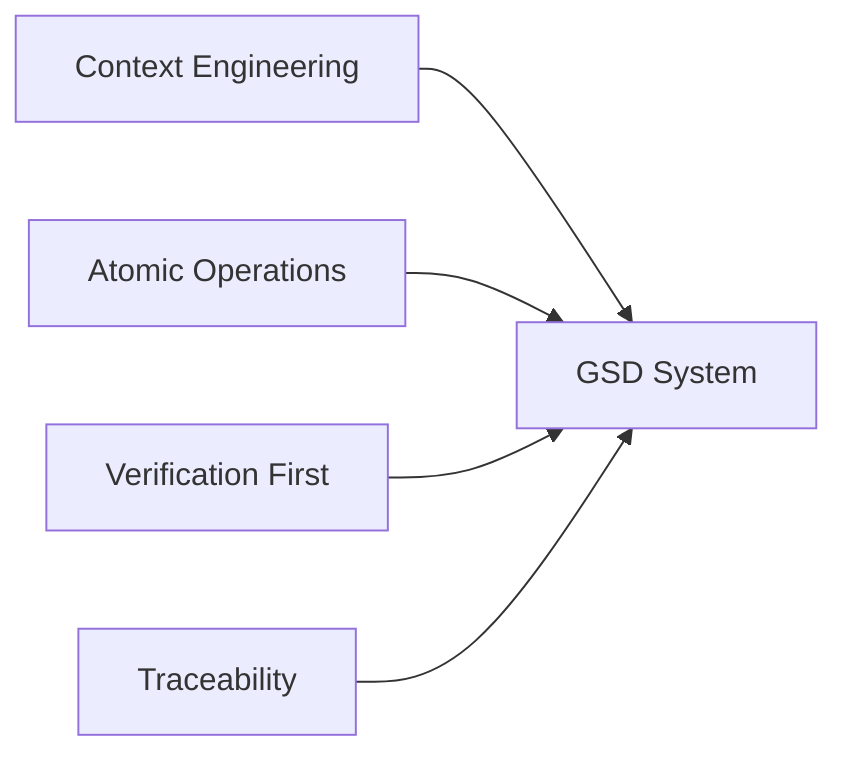
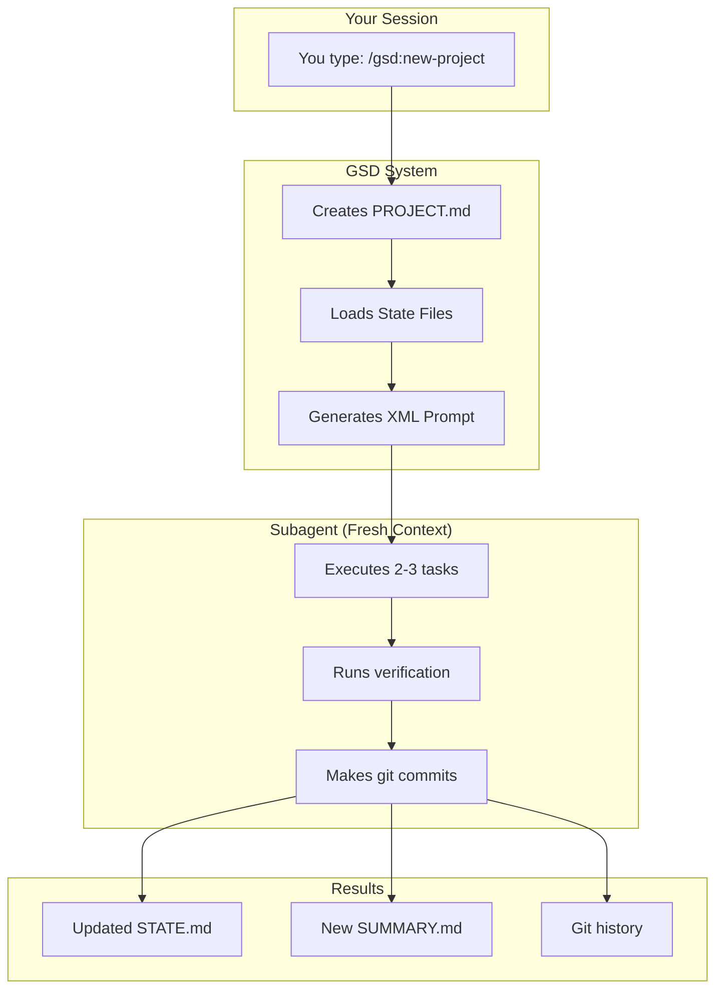

# GSD (Get Shit Done) - One-Hour Class Plan

**Target Audience**: Developers using Claude Code
**Goal**: Understand GSD philosophy, architecture, and how to use it effectively

---

## Time Breakdown (60 minutes total)

| Section | Duration | Purpose |
|----------|----------|---------|
| 1. Introduction | 5 min | Hook the audience |
| 2. The Problem | 10 min | Why GSD exists |
| 3. Core Philosophy | 10 min | Mental model |
| 4. Architecture & State Files | 15 min | How it works |
| 5. Commands & Workflows | 10 min | Practical usage |
| 6. Live Demo | 5 min | See it in action |
| 7. Q&A | 5 min | Address questions |

---

## Section 1: Introduction (5 min)

### What You'll Cover

1. **What is GSD?**
   - "Get Shit Done" - A meta-prompting system for Claude Code
   - Created by TÂCHES
   - Open source: github.com/glittercowboy/get-shit-done
   - 3,300+ stars, 15,000+ installs

2. **One-Liner Pitch**
   > "GSD manages Claude's context limitations through surgical task breakdown, atomic git commits, and verification-driven development."

3. **Agenda**
   - The problem: Why we need GSD
   - The solution: How GSD works
   - The practice: Commands and workflows
   - Demo: See it live

### Key Talking Points
- "You've probably noticed Claude gets confused with large codebases"
- "GSD solves this by breaking work into bite-sized chunks"
- "By the end of this hour, you'll understand how to use GSD effectively"

---

## Section 2: The Problem (10 min)

### The Core Issue: Context Degradation

**Explain with this analogy:**

```
Small conversation (50k tokens)  →  Claude is brilliant
Medium conversation (100k tokens) →  Claude is good
Large conversation (200k tokens)  →  Claude degrades
Huge conversation (300k+ tokens)  →  Claude hallucinates
```

**Visual aid you can draw:**

```
Quality
    ↑
100%|  ╭──────╮
    | ╱        ╲
75% |╱          ╲
    |            ╲
50% |             ╲_________
    |
25% |                       ╲_________________
    |
    0%────┬────┬────┬────┬────┬────> Context Size
         50k 100k 150k 200k 250k 300k
```

### The Symptoms Everyone Recognizes

Ask audience: "Who has experienced..."
- ✋ Claude forgetting earlier context
- ✋ Claude contradicting itself
- ✋ Claude making up functions that don't exist
- ✋ Claude struggling with large refactors

### The Traditional Solutions (and why they fail)

| Approach | Problem |
|----------|---------|
| "Just be more specific" | Still hits context limits |
| "Use bigger prompts" | Opposite of what helps |
| "Start new conversations" | Lose all context |
| "Copy-paste manually" | Error-prone, slow |

### The GSD Insight

**The key insight**: Instead of fighting context limits, design a system that works within them.

- ✅ Max 200k tokens per subagent
- ✅ Fresh context for each task
- ✅ State files preserve what matters
- ✅ Atomic commits = reversible history

---

## Section 3: Core Philosophy (10 min)

### The Four Pillars

Show this diagram:



### Pillar 1: Context Engineering (2 min)

**Rule**: Max 200k tokens per subagent session

**Why?**
- 200k tokens = Claude's sweet spot
- Beyond this, quality degrades
- Solution: Fresh subagent per phase

**Visual:**
```
┌─────────────────────────────────────┐
│   Main Session (You + Claude)       │
│   - Handles commands                │
│   - Manages state files             │
│   - Spawns subagents for work       │
└─────────────────────────────────────┘
              ↓ (spawn)
┌─────────────────────────────────────┐
│   Subagent (Fresh 200k context)     │
│   - Does the actual work            │
│   - Executes 2-3 tasks              │
│   - Returns when done               │
└─────────────────────────────────────┘
```

### Pillar 2: Atomic Operations (2 min)

**Rule**: Max 3 tasks per plan

**Why?**
- Small tasks = verifiable
- One task = one git commit
- If something breaks, you know exactly where

**Example:**
```
❌ Bad: "Implement user authentication"
   - Too big
   - Can't verify easily
   - Hard to debug if broken

✅ Good: "Add login form HTML"
   - Atomic
   - Easy to verify
   - One commit
```

### Pillar 3: Verification-Driven Development (3 min)

**Rule**: Every task has `<verify>` steps

**The XML Structure:**
```xml
<task>
  <action>
    Add login form to index.html
  </action>

  <verify>
    1. Form appears on /login page
    2. Email and password fields present
    3. Submit button visible
    4. Form validates empty fields
  </verify>

  <done>
    - HTML form created
    - Basic styling applied
    - Validation working
  </done>
</task>
```

**Key point**: You don't mark a task done until verification passes

### Pillar 4: Traceability (3 min)

**Rule**: Every git commit includes phase ID

**Commit format:**
```
feat(phase-01): add user login form

- Create login.html with email/password fields
- Add basic form validation
- Style with CSS

Co-Authored-By: Claude <noreply@anthropic.com>
```

**Why this matters:**
- `phase-01` tells you which phase
- Git blame tells you when
- Easy to revert if needed

**The beauty**: Each commit is a logical unit of work

---

## Section 4: Architecture & State Files (15 min)

### The Big Picture Diagram (5 min)

Show this architecture:



**Explain the flow:**
1. You type a command
2. GSD reads state files
3. GSD creates a plan with XML tasks
4. Subagent executes (fresh context!)
5. Results committed and saved

### The Six Core State Files (7 min)

**Draw this table on whiteboard:**

| File | Purpose | Always Loaded? | Lifecycle |
|------|---------|----------------|-----------|
| **PROJECT.md** | Vision, goals | ✅ Yes | Once |
| **ROADMAP.md** | Phases, milestones | ✅ Yes | Every phase |
| **STATE.md** | Decisions, blockers | ✅ Yes | Continuous |
| **PLAN.md** | Current tasks | ❌ No | Recreated |
| **SUMMARY.md** | What happened | ❌ No | After phase |
| **ISSUES.md** | Deferred items | ❌ No | As needed |

#### Explain Each File:

**PROJECT.md** (The North Star)
- Created once with `/gsd:new-project`
- Contains: Project vision, success criteria, constraints
- Rarely changes
- **Always loaded into context**

```
Example:
# My Project
## Vision
Build a todo app that syncs across devices.

## Success Criteria
- Users can add/edit/delete tasks
- Data syncs to cloud
- Works offline
```

**ROADMAP.md** (The Journey)
- Created with `/gsd:create-roadmap`
- Contains: Phases, milestones, progress tracking
- Updated every phase
- **Always loaded into context**

```
Example:
# Milestone 1: MVP
- Phase 1: Project setup ✅
- Phase 2: Auth system ✅
- Phase 3: CRUD operations ⏳

# Milestone 2: Polish
- Phase 4: UI/UX
- Phase 5: Testing
```

**STATE.md** (The Memory)
- Created with ROADMAP.md
- Contains: Decisions made, blockers, current position
- Critical for continuity across sessions
- **Always loaded into context**

```
Example:
# Decisions
- Using Next.js for frontend
- Using Supabase for backend

# Current Position
- Working on Phase 3
- Blocked on: API rate limiting

# Blockers
- Need API key from provider
```

**PLAN.md** (The Current Tasks)
- Created with `/gsd:plan-phase`
- Contains: 2-3 tasks with XML structure
- **NOT always loaded** (only for current phase)
- Recreated each phase

```
Example:
<task>
  <action>Create login page</action>
  <verify>Page renders, form works</verify>
  <done>HTML, CSS, validation done</done>
</task>
```

**SUMMARY.md** (The History)
- Created after each phase
- Contains: What happened, what changed
- Committed to git (permanent record)
- NOT loaded into context (reference only)

**ISSUES.md** (The Parking Lot)
- Created as needed
- Contains: Deferred enhancements, bugs, ideas
- NOT loaded into context

### Brownfield Files (3 min)

**For existing codebases**, `/gsd:map-codebase` creates 7 extra files:

| File | Purpose |
|------|---------|
| `STACK.md` | What tech you're using |
| `ARCHITECTURE.md` | How the system fits together |
| `STRUCTURE.md` | Folder/file organization |
| `CONVENTIONS.md` | Coding patterns |
| `TESTING.md` | Test approach |
| `INTEGRATIONS.md` | External APIs |
| `CONCERNS.md` | Technical debt |

**Key point**: These give GSD context about your existing code

---

## Section 5: Commands & Workflows (10 min)

### The 17 Commands Overview (2 min)

**Mention you don't need to memorize all 17** - focus on the core 5:

| Command | When to Use |
|---------|-------------|
| `/gsd:new-project` | Starting fresh |
| `/gsd:create-roadmap` | Planning the journey |
| `/gsd:plan-phase` | Ready to work |
| `/gsd:execute-plan` | Doing the work |
| `/gsd:progress` | Check status |

**Other useful ones:**
- `/gsd:insert-phase` - Add functionality mid-project
- `/gsd:complete-milestone` - Ship a milestone
- `/gsd:map-codebase` - Existing codebases

### Greenfield Workflow (5 min)

**Step-by-step for new projects:**

```
┌─────────────────────────────────────────────────────────┐
│  STEP 1: Initialize                                     │
│  Command: /gsd:new-project                              │
│  Creates: PROJECT.md                                    │
│  Time: 2 minutes                                         │
└─────────────────────────────────────────────────────────┘
                          ↓
┌─────────────────────────────────────────────────────────┐
│  STEP 2: Plan the Roadmap                               │
│  Command: /gsd:create-roadmap                           │
│  Creates: ROADMAP.md + STATE.md                         │
│  Time: 5-10 minutes                                      │
└─────────────────────────────────────────────────────────┘
                          ↓
┌─────────────────────────────────────────────────────────┐
│  STEP 3: Plan First Phase                               │
│  Command: /gsd:plan-phase 1                             │
│  Creates: PLAN.md (2-3 tasks)                           │
│  Time: 3-5 minutes                                       │
└─────────────────────────────────────────────────────────┘
                          ↓
┌─────────────────────────────────────────────────────────┐
│  STEP 4: Execute                                        │
│  Command: /gsd:execute-plan                             │
│  Creates: Git commits, SUMMARY.md                       │
│  Time: 10-30 minutes (depends on tasks)                 │
└─────────────────────────────────────────────────────────┘
                          ↓
                    ┌─────────┐
                    │ Repeat? │
                    └─────────┘
                       /    \
                     Yes    No
                      /      \
              Step 3        Step 5
                         (Next milestone)
```

**Key insight**: You're not working on the whole project - just 2-3 tasks at a time

### Brownfield Workflow (2 min)

**For existing codebases**, add one step at the beginning:

```
Existing Codebase
       ↓
/gsd:map-codebase  ← Generates 7 brownfield files
       ↓
Then same as greenfield from /gsd:create-roadmap
```

### Insert Functionality (1 min)

**Adding new features mid-project:**

```
Option A: /gsd:add-phase         → Add to end
Option B: /gsd:insert-phase 3    → Insert at position 3
Option C: /gsd:new-milestone     → Add new milestone
```

---

## Section 6: Live Demo (5 min)

### Quick Live Demo Options

**Option A: If you have a project ready**
```bash
# Show current status
/gsd:progress

# Show plan
cat .gsd/PLAN.md

# Execute one task
/gsd:execute-plan
```

**Option B: Create toy project during class**
```bash
# Start a tiny project
/gsd:new-project
# Vision: Build a hello world app

/gsd:create-roadmap
# 1 milestone, 2 phases

/gsd:plan-phase 1
# Show the XML structure

/gsd:execute-plan
# Watch it run
```

**Option C: Show recorded demo**
- Screen recording of GSD in action
- 3-4 minutes max
- Show a phase completing

### What to Highlight During Demo

1. **State file loading** - Mention which files are being read
2. **XML task structure** - Show the `<action>`, `<verify>`, `<done>` tags
3. **Subagent spawning** - Explain fresh context
4. **Git commits** - Show atomic commits happening
5. **Summary creation** - Show what gets written to SUMMARY.md

---

## Section 7: Q&A (5 min)

### Anticipated Questions

**Q: "Is GSD only for big projects?"**
A: No! Even small projects benefit. But GSD shines on:
- Projects with 5+ phases
- Complex refactors
- Multiple sessions

**Q: "Can I use GSD with other AI tools?"**
A: GSD is designed for Claude Code, but the philosophy applies anywhere.

**Q: "What if I mess up a task?"**
A: That's the beauty of atomic commits - revert one commit, fix, redo.

**Q: "Do I need to use all 17 commands?"**
A: No! The core 5 will handle 90% of cases.

**Q: "How long does setup take?"**
A: Greenfield: ~10 minutes. Brownfield: ~20 minutes (for codebase mapping).

**Q: "Can I adapt GSD to my workflow?"**
A: Yes! It's open source. Fork it, customize it.

---

## Handout: One-Page Cheat Sheet

```markdown
# GSD Quick Reference

## Core Philosophy
- Max 200k tokens per subagent (maintain quality)
- Max 3 tasks per plan (atomic operations)
- Every task has verification (QA first)
- One git commit per task (traceability)

## The Core 5 Commands
1. `/gsd:new-project` - Start fresh
2. `/gsd:create-roadmap` - Plan journey
3. `/gsd:plan-phase N` - Plan 2-3 tasks
4. `/gsd:execute-plan` - Do the work
5. `/gsd:progress` - Check status

## State Files (Always Loaded)
- PROJECT.md - Vision
- ROADMAP.md - Phases & milestones
- STATE.md - Decisions & position

## Typical Workflow
1. /gsd:new-project
2. /gsd:create-roadmap
3. /gsd:plan-phase 1
4. /gsd:execute-plan
5. Repeat steps 3-4 until done

## Key URLs
- GitHub: github.com/glittercowboy/get-shit-done
- Issues: github.com/glittercowboy/get-shit-done/issues
```

---

## Tips for Delivery

### For Each Section

**Introduction**
- Energy high, hook them early
- Use the "you've probably experienced..." approach

**The Problem**
- Get head nods on symptoms
- Make the pain real

**Philosophy**
- Use the whiteboard for diagrams
- Keep it conceptual, not technical

**Architecture**
- This is the meat - take your time
- Use the state file table
- Emphasize which files are always loaded

**Commands**
- Don't list all 17 - focus on core 5
- Show the workflow visually

**Demo**
- Keep it moving
- Explain what's happening
- Don't let it drag

**Q&A**
- Have 3-4 backup questions ready
- If no questions, share "common mistakes"

### Common Mistakes to Mention

1. **Skipping `/gsd:map-codebase` on brownfield projects**
2. **Trying to do too much in one task**
3. **Forgetting to verify before marking done**
4. **Not reading STATE.md before continuing work**

### Engagement Ideas

- Ask: "Who has hit context limits?"
- Poll: "What's your biggest Claude frustration?"
- Show: Git history with phase IDs
- Promise: "By the end, you'll know how to use GSD"

---

## Final Summary for Class

**GSD in one sentence:**
> "GSD is a system that works within Claude's context limitations through surgical task breakdown, atomic git commits, and verification-driven development."

**The key takeaway:**
You don't fight context limits - you design a system that embraces them.

**What they should be able to do after this class:**
1. ✅ Explain why GSD exists
2. ✅ Name the four pillars
3. ✅ Describe the six state files
4. ✅ Use the core 5 commands
5. ✅ Start a project with GSD

---

**Good luck with your class!** 🚀
