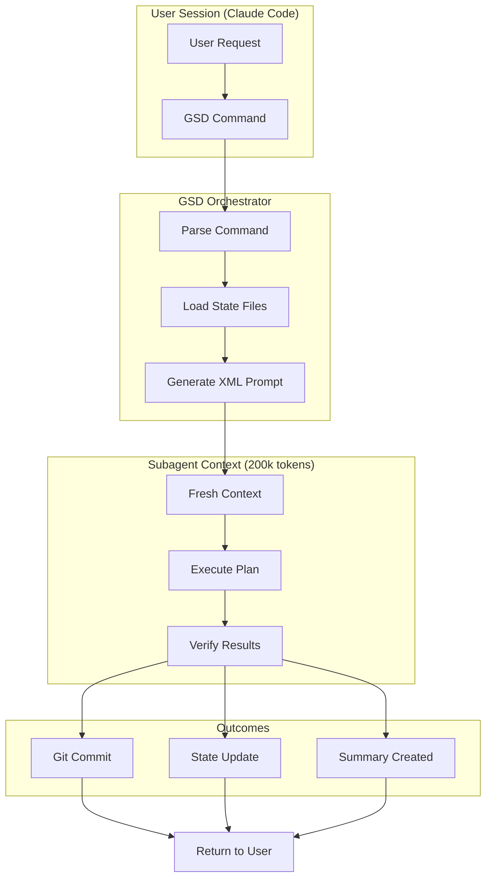
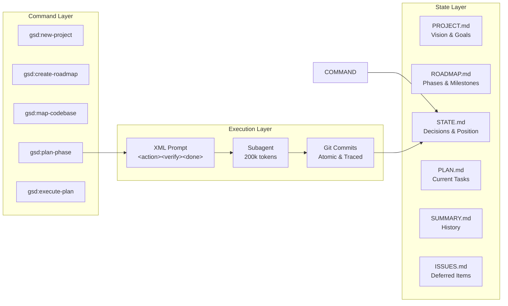
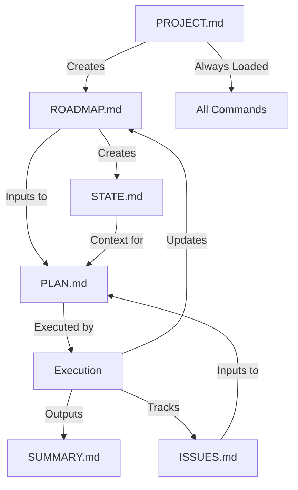
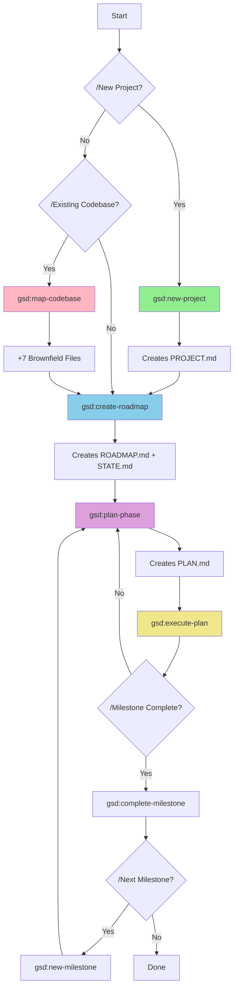
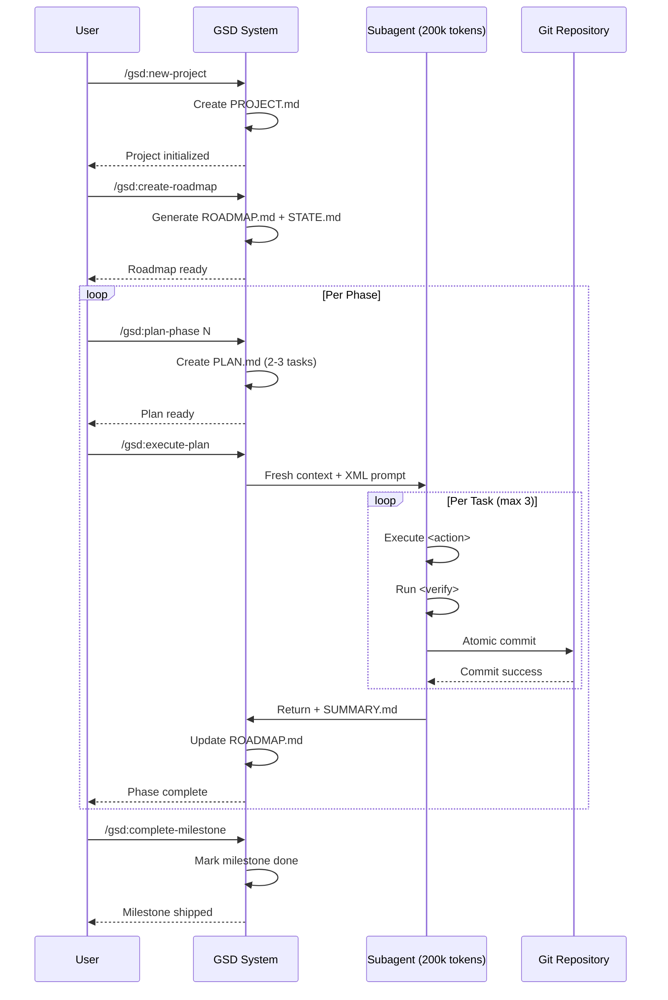
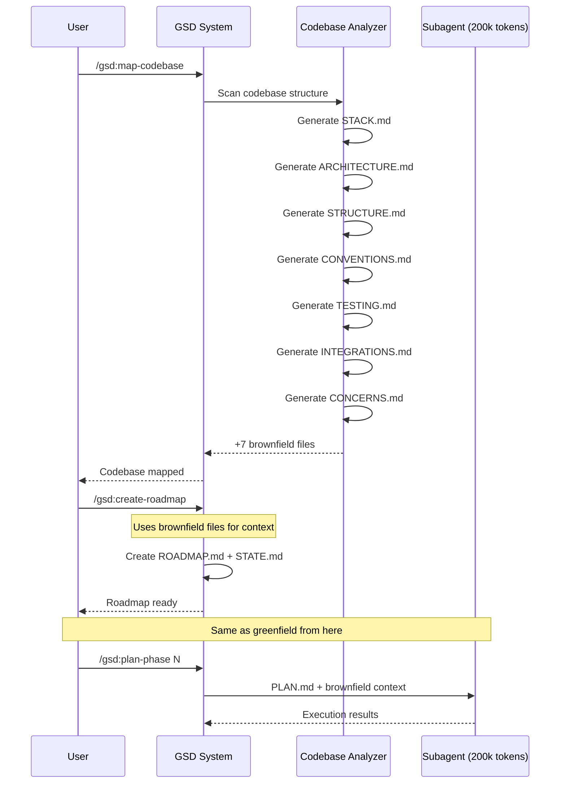
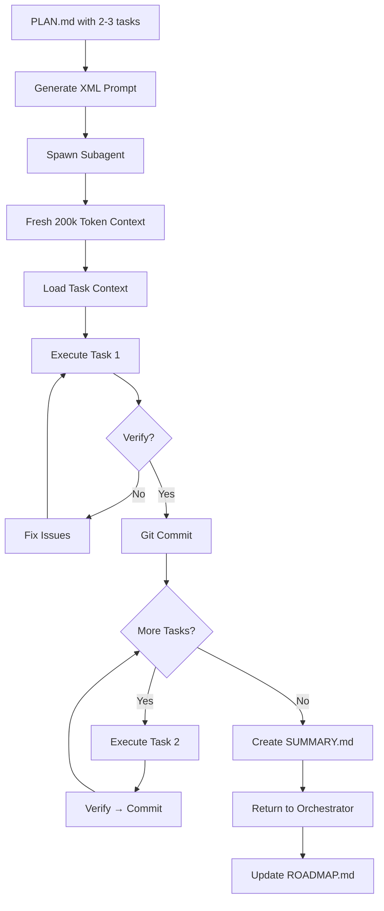
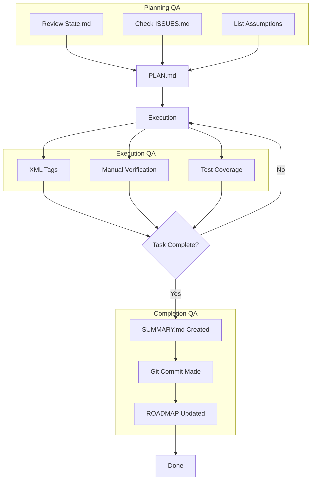

# Get Shit Done (GSD) - Architecture Overview

**A meta-prompting, context engineering and spec-driven development system for Claude Code by TÂCHES.**

---

## Table of Contents

1. [Philosophy & Core Principles](#philosophy--core-principles)
2. [System Architecture](#system-architecture)
3. [State File Ecosystem](#state-file-ecosystem)
4. [Command Reference](#command-reference)
5. [Workflow Flows](#workflow-flows)
6. [Implementation Patterns](#implementation-patterns)

---

## Philosophy & Core Principles

### The Problem GSD Solves

Claude's quality degrades with context size. GSD manages this complexity through:

1. **Context Engineering** - Maximum 200k tokens per subagent session
2. **Atomic Operations** - Maximum 3 tasks per plan
3. **Verification-Driven Development** - Every task includes verification steps
4. **Surgical Git Commits** - One commit per task, immediately upon completion

### Core Architecture Pattern



---

## System Architecture

### High-Level Component Overview



### State File Relationships



---

## State File Ecosystem

| File         | Purpose                          | Lifecycle                    | Always Loaded |
| ------------ | -------------------------------- | ---------------------------- | ------------- |
| `PROJECT.md` | Project vision, success criteria | Created once, updated rarely | ✅ Yes        |
| `ROADMAP.md` | Phases, milestones, progress     | Updated every phase          | ✅ Yes        |
| `STATE.md`   | Decisions, blockers, position    | Memory across sessions       | ✅ Yes        |
| `PLAN.md`    | Atomic tasks (max 3) with XML    | Recreated each phase         | ❌ No         |
| `SUMMARY.md` | What happened, changes           | Committed after each phase   | ❌ No         |
| `ISSUES.md`  | Deferred enhancements            | Tracked across sessions      | ❌ No         |

### Brownfield-Only Files

Generated by `/gsd:map-codebase` for existing codebases:

| File              | Purpose                           |
| ----------------- | --------------------------------- |
| `STACK.md`        | Technology stack inventory        |
| `ARCHITECTURE.md` | System architecture documentation |
| `STRUCTURE.md`    | Codebase structure overview       |
| `CONVENTIONS.md`  | Coding conventions and patterns   |
| `TESTING.md`      | Testing approach and coverage     |
| `INTEGRATIONS.md` | External dependencies and APIs    |
| `CONCERNS.md`     | Technical debt and known issues   |

---

## Command Reference

### Command Dependency Map



### All 17 GSD Commands

| Command                       | Purpose                  | Creates                 | Reads                |
| ----------------------------- | ------------------------ | ----------------------- | -------------------- |
| `/gsd:new-project`            | Initialize new project   | PROJECT.md              | None                 |
| `/gsd:create-roadmap`         | Create phases/milestones | ROADMAP.md, STATE.md    | PROJECT.md           |
| `/gsd:map-codebase`           | Analyze existing code    | +7 brownfield files     | Codebase             |
| `/gsd:plan-phase`             | Plan next 2-3 tasks      | PLAN.md                 | ROADMAP.md, STATE.md |
| `/gsd:execute-plan`           | Execute current plan     | Git commits, SUMMARY.md | PLAN.md              |
| `/gsd:progress`               | Show current status      | None                    | All state files      |
| `/gsd:complete-milestone`     | Mark milestone done      | Updated ROADMAP.md      | ROADMAP.md           |
| `/gsd:discuss-milestone`      | Review milestone         | None                    | ROADMAP.md           |
| `/gsd:new-milestone`          | Add next milestone       | Updated ROADMAP.md      | ROADMAP.md           |
| `/gsd:add-phase`              | Add phase to end         | Updated ROADMAP.md      | ROADMAP.md           |
| `/gsd:insert-phase`           | Insert phase at position | Updated ROADMAP.md      | ROADMAP.md           |
| `/gsd:discuss-phase`          | Review specific phase    | None                    | ROADMAP.md           |
| `/gsd:research-phase`         | Research before planning | Research artifacts      | ROADMAP.md           |
| `/gsd:list-phase-assumptions` | Show assumptions         | None                    | PLAN.md              |
| `/gsd:pause-work`             | Save work state          | Pause checkpoint        | All state files      |
| `/gsd:resume-work`            | Restore work state       | None                    | Pause checkpoint     |

---

## Workflow Flows

### Greenfield Project Flow (New Projects)



### Brownfield Project Flow (Existing Codebases)



### Insert Phase Flow (Adding Functionality)

```mermaid
graph LR
    A[Existing Roadmap] -->|/gsd:insert-phase 3| B[Insert Point]
    B --> C[New Phase Plan]
    C --> D{Analyze Impact}
    D -->|Dependent| E[Update Later Phases]
    D -->|Independent| F[Add to Roadmap]
    E --> G[Update STATE.md Decisions]
    F --> G
    G --> H[Ready to Plan]
    H --> I[/gsd:plan-phase]
```

---

## Implementation Patterns

### XML Task Structure

Every task in PLAN.md follows this structure:

```xml
<task>
  <action>
    Specific action to take
  </action>

  <verify>
    Verification steps to confirm completion
  </verify>

  <done>
    Definition of done checklist
  </done>
</task>
```

### Subagent Execution Pattern



### Git Commit Pattern

Each task creates one atomic commit:

```
feat(phase-01): add user authentication login page

- Implement login form with email/password
- Add form validation
- Integrate with auth API

Co-Authored-By: Claude <noreply@anthropic.com>
```

- **Format**: Conventional commits with phase ID
- **Traceability**: Phase and task in every commit
- **Immediacy**: Commit immediately after task completion
- **Atomicity**: One task = one commit

### Quality Assurance Mechanisms



---

## Quick Start Guide

### For New Projects (Greenfield)

```bash
# 1. Initialize project
/gsd:new-project
# Creates: PROJECT.md

# 2. Create roadmap
/gsd:create-roadmap
# Creates: ROADMAP.md, STATE.md

# 3. Plan first phase
/gsd:plan-phase 1
# Creates: PLAN.md (2-3 tasks)

# 4. Execute plan
/gsd:execute-plan
# Creates: Git commits, SUMMARY.md
# Updates: ROADMAP.md

# 5. Repeat for each phase
/gsd:plan-phase 2
/gsd:execute-plan

# 6. Complete milestone
/gsd:complete-milestone
```

### For Existing Codebases (Brownfield)

```bash
# 1. Map the codebase FIRST
/gsd:map-codebase
# Creates: STACK.md, ARCHITECTURE.md, STRUCTURE.md,
#          CONVENTIONS.md, TESTING.md, INTEGRATIONS.md, CONCERNS.md

# 2. Then create roadmap (uses brownfield files)
/gsd:create-roadmap
# Creates: ROADMAP.md, STATE.md

# 3. Continue as greenfield from here
/gsd:plan-phase 1
/gsd:execute-plan
```

### To Insert New Functionality

```bash
# Option 1: Add phase to end
/gsd:add-phase
# Prompts for phase details, appends to ROADMAP.md

# Option 2: Insert at specific position
/gsd:insert-phase 3
# Inserts new phase at position 3
# Shifts existing phases 3+ down by one

# Option 3: Add milestone
/gsd:new-milestone
# Adds new milestone to roadmap

# Then plan and execute as normal
/gsd:plan-phase N
/gsd:execute-plan
```

---

## Key Principles Summary

1. **Context Management**: Max 200k tokens per subagent to maintain quality
2. **Atomic Tasks**: Max 3 tasks per plan, one git commit each
3. **Verification First**: Every task has verification steps
4. **State Memory**: STATE.md preserves decisions across sessions
5. **Traceability**: Every commit includes phase ID
6. **Greenfield vs Brownfield**: New projects skip codebase mapping
7. **Interruptible**: `/gsd:pause-work` and `/gsd:resume-work` for long projects

---

## File Structure Example

```
project-root/
├── .gsd/
│   ├── PROJECT.md          # Vision (always loaded)
│   ├── ROADMAP.md          # Phases (always loaded)
│   ├── STATE.md            # Memory (always loaded)
│   ├── PLAN.md             # Current tasks (recreated)
│   ├── SUMMARY.md          # History (committed)
│   ├── ISSUES.md           # Deferred (tracked)
│   ├── STACK.md            # Brownfield only
│   ├── ARCHITECTURE.md     # Brownfield only
│   ├── STRUCTURE.md        # Brownfield only
│   ├── CONVENTIONS.md      # Brownfield only
│   ├── TESTING.md          # Brownfield only
│   ├── INTEGRATIONS.md     # Brownfield only
│   └── CONCERNS.md         # Brownfield only
├── src/
└── [project files]
```

---

## Summary

GSD is a sophisticated development orchestration system that:

- **Manages context complexity** through subagent isolation (200k token limit)
- **Enables atomic progress** through surgical git commits (1 task = 1 commit)
- **Maintains project memory** through state files (PROJECT, ROADMAP, STATE)
- **Supports both greenfield and brownfield** projects with appropriate workflows
- **Provides verification-driven development** with XML-structured tasks
- **Scales to large projects** through phase/milestone breakdown

The system is designed specifically for Claude Code's context limitations while maintaining development velocity and code quality through strict process discipline.

---

_Generated from analysis of https://github.com/glittercowboy/get-shit-done_
