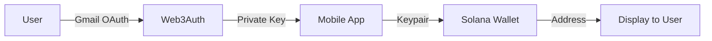
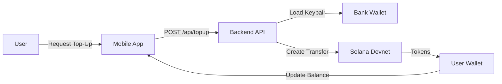
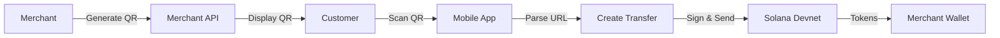
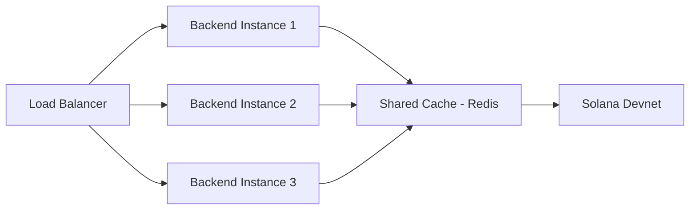
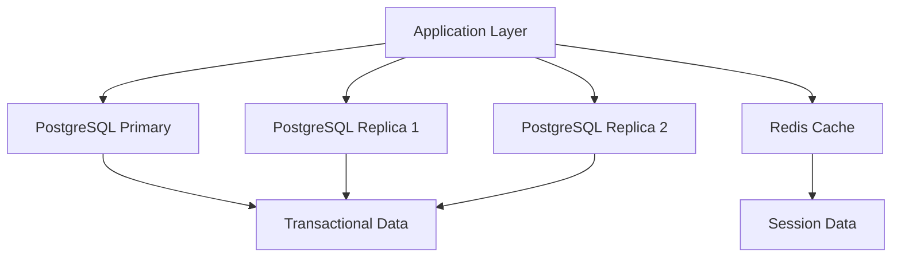

# System Architecture

DCWLT is a multi-service architecture demonstrating a complete crypto wallet flow using Solana Devnet.

## Table of Contents

- [Overview](#overview)
- [High-Level Architecture](#high-level-architecture)
- [Component Architecture](#component-architecture)
- [Data Flow](#data-flow)
- [Technology Stack](#technology-stack)
- [Deployment Architecture](#deployment-architecture)
- [Security Architecture](#security-architecture)
- [Scalability Considerations](#scalability-considerations)

## Overview

DCWLT (Digital Currency Wallet with Ledger Technology) is a Proof of Concept (POC) that demonstrates:

1. **Gmail Authentication** → Solana Wallet Derivation (via Web3Auth)
2. **Simulated Visa Top-Up** → Event Token Transfer
3. **QR Code Payments** → Merchant-Customer Transactions

### Design Principles

- **Non-Custodial**: Users maintain full control of their wallets
- **Social Login**: Gmail OAuth eliminates seed phrase management
- **Testnet Only**: All operations use Solana Devnet (no real money)
- **Mobile-First**: Native Android app with React Native

## High-Level Architecture

```
┌─────────────────────────────────────────────────────────────────────────────┐
│                              DCWLT Architecture                             │
├─────────────────────────────────────────────────────────────────────────────┤
│                                                                             │
│  ┌─────────────┐      ┌──────────────┐      ┌─────────────────────────┐   │
│  │   Gmail     │─────>│   Web3Auth   │─────>│  Solana Devnet          │   │
│  │   OAuth     │      │   Key Gen    │      │  (Blockchain Layer)      │   │
│  └─────────────┘      └──────────────┘      │  - Event Token           │   │
│                                              │  - User Wallets          │   │
│                                              │  - Bank Wallet           │   │
│  ┌─────────────┐      ┌──────────────┐      └─────────────────────────┘   │
│  │   Mobile    │─────>│   Backend    │                  │                │
│  │    App      │      │   APIs       │<─────────────────┘                │
│  │             │      │  (Top-Up)    │                                   │
│  └─────────────┘      └──────────────┘                                   │
│        │                     │                                            │
│        │                     v                                            │
│        │              ┌──────────────┐                                   │
│        └────────────>│   Merchant   │                                    │
│                       │   API        │                                    │
│                       │ (QR Gen)     │                                    │
│                       └──────────────┘                                    │
└─────────────────────────────────────────────────────────────────────────────┘
```

## Component Architecture

### 1. Mobile Application (`event-wallet/`)

**Technology**: React Native + Expo + TypeScript

**Purpose**: User-facing Android wallet app

**Key Components**:

```
event-wallet/
├── src/
│   ├── config/
│   │   └── constants.ts          # App constants (TOKEN_ADDRESS, endpoints)
│   ├── contexts/
│   │   └── Web3AuthContext.tsx   # Web3Auth provider & wallet state
│   ├── screens/
│   │   ├── LoginScreen.tsx       # Gmail login UI
│   │   ├── DashboardScreen.tsx   # Balance display & top-up
│   │   └── QRScannerScreen.tsx   # QR code scanner
│   ├── services/
│   │   └── solana.ts             # Solana RPC interactions
│   └── polyfills.ts              # Crypto polyfills for React Native
```

**Responsibilities**:
- User authentication via Gmail OAuth
- Wallet address derivation from Web3Auth
- Balance display and management
- QR code scanning for payments
- Transaction signing and submission

### 2. Backend API (`backend/`)

**Technology**: Express + TypeScript + Node.js

**Purpose**: Top-up API server

**Key Components**:

```
backend/
├── src/
│   ├── routes/
│   │   └── topup.ts              # POST /api/topup endpoint
│   ├── services/
│   │   └── tokenService.ts       # SPL token transfer logic
│   └── index.ts                  # Express server setup
├── .env                          # Environment configuration
└── package.json
```

**Responsibilities**:
- Handle top-up requests from mobile app
- Load bank wallet keypair
- Create and sign SPL token transfers
- Submit transactions to Solana Devnet

**API Endpoints**:
- `POST /api/topup` - Simulate Visa top-up

### 3. Merchant API (`merchant/`)

**Technology**: Express + Node.js

**Purpose**: QR code generation server

**Key Components**:

```
merchant/
├── routes/
│   └── index.ts                  # Home & QR generation routes
├── services/
│   └── qrService.ts              # QR code generation
├── views/
│   └── qr.html                   # QR display template
├── .env                          # Merchant wallet configuration
└── package.json
```

**Responsibilities**:
- Generate Solana Pay QR codes
- Display payment QR to customers
- Provide merchant dashboard

**API Endpoints**:
- `GET /` - Merchant dashboard
- `GET /qr` - Generate payment QR code

## Data Flow

### Authentication Flow



### Top-Up Flow



### Payment Flow



## Technology Stack

### Mobile Application

| Component | Technology | Purpose |
|-----------|------------|---------|
| Framework | React Native | Cross-platform mobile development |
| Toolkit | Expo | Development & build tools |
| Language | TypeScript | Type-safe code |
| Authentication | @web3auth/react-native-sdk | Gmail OAuth → Wallet |
| Blockchain | @solana/web3.js | Solana RPC client |
| SPL Tokens | @solana/spl-token | Token operations |
| Camera | expo-camera | QR code scanning |
| Crypto | react-native-get-random-values | Polyfills |

### Backend Services

| Component | Technology | Purpose |
|-----------|------------|---------|
| Framework | Express | HTTP server |
| Language | TypeScript (backend) / JavaScript (merchant) |
| Blockchain | @solana/web3.js | Solana transactions |
| QR Codes | qrcode | QR generation |
| Environment | dotenv | Configuration |

### Blockchain

| Component | Technology | Purpose |
|-----------|------------|---------|
| Network | Solana Devnet | Testnet blockchain |
| Token Standard | SPL Token | Custom token |
| Wallet Type | Ed25519 | Solana keypairs |
| Payment Standard | Solana Pay | QR payment URLs |

## Deployment Architecture

### Development Environment

```
┌─────────────────────────────────────────────────────────────┐
│                    Developer Machine                         │
├─────────────────────────────────────────────────────────────┤
│                                                             │
│  ┌─────────────┐  ┌─────────────┐  ┌─────────────┐        │
│  │   Android   │  │   Terminal  │  │   Browser   │        │
│  │  Emulator   │  │  (Backend)  │  │ (Merchant)  │        │
│  │   :8081     │  │    :3000    │  │    :3001    │        │
│  └─────────────┘  └─────────────┘  └─────────────┘        │
│         │                 │                 │               │
│         └─────────────────┴─────────────────┘               │
│                           │                                 │
│                           v                                 │
│                   ┌─────────────┐                          │
│                   │  Solana     │                          │
│                   │  Devnet RPC │                          │
│                   │  (Public)   │                          │
│                   └─────────────┘                          │
└─────────────────────────────────────────────────────────────┘
```

### Production Architecture (Future)

```
┌─────────────────────────────────────────────────────────────┐
│                      Production Environment                  │
├─────────────────────────────────────────────────────────────┤
│                                                             │
│  ┌─────────────┐  ┌─────────────┐  ┌─────────────┐        │
│  │  Android    │  │  Android    │  │    iOS      │        │
│  │    App      │  │    App      │  │    App      │        │
│  └─────────────┘  └─────────────┘  └─────────────┘        │
│         │                 │                 │               │
│         └─────────────────┴─────────────────┘               │
│                           │                                 │
│                           v                                 │
│  ┌─────────────────────────────────────────────┐           │
│  │           Load Balancer / API Gateway       │           │
│  └─────────────────────────────────────────────┘           │
│                           │                                 │
│           ┌───────────────┼───────────────┐                 │
│           v               v               v                 │
│  ┌─────────────┐  ┌─────────────┐  ┌─────────────┐        │
│  │   Backend   │  │   Backend   │  │   Backend   │        │
│  │  Instance   │  │  Instance   │  │  Instance   │        │
│  └─────────────┘  └─────────────┘  └─────────────┘        │
│                           │                                 │
│                           v                                 │
│                   ┌─────────────┐                          │
│                   │  Solana     │                          │
│                   │  Mainnet    │                          │
│                   └─────────────┘                          │
└─────────────────────────────────────────────────────────────┘
```

## Security Architecture

### Authentication Layer

```
┌─────────────────────────────────────────────────────────────┐
│                      Authentication                          │
├─────────────────────────────────────────────────────────────┤
│                                                             │
│  User → Gmail → Web3Auth → Private Key → Wallet Address    │
│                                                             │
│  - No seed phrases                                          │
│  - Non-custodial (user owns keys)                           │
│  - Recoverable via Gmail                                    │
│                                                             │
└─────────────────────────────────────────────────────────────┘
```

### Transaction Security

```
┌─────────────────────────────────────────────────────────────┐
│                    Transaction Signing                       │
├─────────────────────────────────────────────────────────────┤
│                                                             │
│  1. Transaction created locally                             │
│  2. Signed with Web3Auth-derived keypair                   │
│  3. Submitted to Solana Devnet                             │
│  4. Verified on blockchain                                  │
│                                                             │
│  - Private keys never leave device                          │
│  - All signatures local                                     │
│  - Verifiable on explorer                                   │
│                                                             │
└─────────────────────────────────────────────────────────────┘
```

### Security Considerations

| Layer | Security Measure | Status |
|-------|------------------|--------|
| Authentication | Web3Auth OAuth | ✅ Implemented |
| Transaction Signing | Local key signing | ✅ Implemented |
| API Authentication | None | ⚠️ POC Only |
| Rate Limiting | None | ⚠️ POC Only |
| Input Validation | Basic | ⚠️ Needs Enhancement |
| HTTPS | Local development | ⚠️ Production Required |

## Scalability Considerations

### Current Limitations (POC)

| Component | Limitation | Production Solution |
|-----------|------------|---------------------|
| Backend API | Single instance | Horizontal scaling + load balancer |
| Bank Wallet | Single keypair | Distributed key management |
| Merchant API | No database | PostgreSQL + Redis cache |
| Mobile App | No push notifications | Firebase Cloud Messaging |

### Scaling Strategies

#### Backend API Scaling



#### Database Architecture (Future)



## Network Topology

### Service Communication

```
┌─────────────────────────────────────────────────────────────┐
│                     Network Flow                             │
├─────────────────────────────────────────────────────────────┤
│                                                             │
│  Mobile App (localhost)                                     │
│       │                                                     │
│       ├──> Backend API (localhost:3000)                     │
│       │      ├──> Solana Devnet RPC (api.devnet.solana.com) │
│       │                                                     │
│       └──> Merchant API (localhost:3001)                    │
│              └──> QR Code Display                           │
│                                                             │
└─────────────────────────────────────────────────────────────┘
```

### External Dependencies

| Service | Endpoint | Purpose |
|---------|----------|---------|
| Solana Devnet RPC | `https://api.devnet.solana.com` | Blockchain interaction |
| Solana Explorer | `https://explorer.solana.com` | Transaction verification |
| Web3Auth | `https://auth.web3auth.io` | OAuth key derivation |
| Gmail OAuth | `https://accounts.google.com` | User authentication |

## Performance Considerations

### Transaction Performance

| Operation | Expected Time | Bottleneck |
|-----------|---------------|------------|
| Gmail Login | 2-3 seconds | OAuth flow |
| Top-Up Request | 3-5 seconds | Blockchain confirmation |
| QR Payment | 2-4 seconds | Blockchain confirmation |
| Balance Fetch | <1 second | RPC response |

### Optimization Opportunities

1. **RPC Endpoints**: Use dedicated Solana RPC nodes
2. **Caching**: Cache wallet balances with TTL
3. **Batching**: Batch multiple transactions
4. **WebSocket**: Use WebSocket subscriptions for real-time updates

## Monitoring & Observability

### Recommended Metrics

| Metric | Purpose | Tool |
|--------|---------|------|
| API Response Time | Performance monitoring | Prometheus |
| Transaction Success Rate | Blockchain health | Custom dashboard |
| User Session Duration | Engagement tracking | Analytics |
| Error Rates | Debugging | Sentry |

### Logging Strategy

```
Mobile App          → Firebase Crashlytics
Backend API         → Winston / CloudWatch
Merchant API        → Winston / CloudWatch
Blockchain Events   → Custom indexers
```

## Architecture Decision Records

### ADR-001: Why Solana Devnet?

**Decision**: Use Solana Devnet instead of mainnet

**Rationale**:
- No real money at risk
- Free SOL for gas fees
- Same API as mainnet
- Easy reset and testing

**Consequences**:
- Cannot test mainnet stress
- Token value is zero
- Requires migration for production

### ADR-002: Why Web3Auth?

**Decision**: Use Web3Auth for wallet derivation

**Rationale**:
- Eliminates seed phrase management
- Social login (Gmail) familiar to users
- Non-custodial (user owns keys)
- Easy recovery

**Consequences**:
- Dependency on Web3Auth service
- Additional integration complexity
- Limited to supported OAuth providers

### ADR-003: Why React Native?

**Decision**: Use React Native for mobile app

**Rationale**:
- Single codebase for Android/iOS
- JavaScript/TypeScript familiarity
- Expo for faster development
- Large ecosystem

**Consequences**:
- Custom dev build required (no Expo Go)
- Crypto library compatibility issues
- Slightly worse performance than native

---

## Future Enhancements

### Short Term (POC Improvements)

1. Add input validation to all APIs
2. Implement basic rate limiting
3. Add transaction history to mobile app
4. Improve error messages

### Long Term (Production Features)

1. Multi-chain support (Ethereum, Polygon)
2. Native iOS application
3. Hardware wallet integration
4. Debit card integration (real Visa)
5. Merchant analytics dashboard
6. Push notifications
7. Biometric authentication
