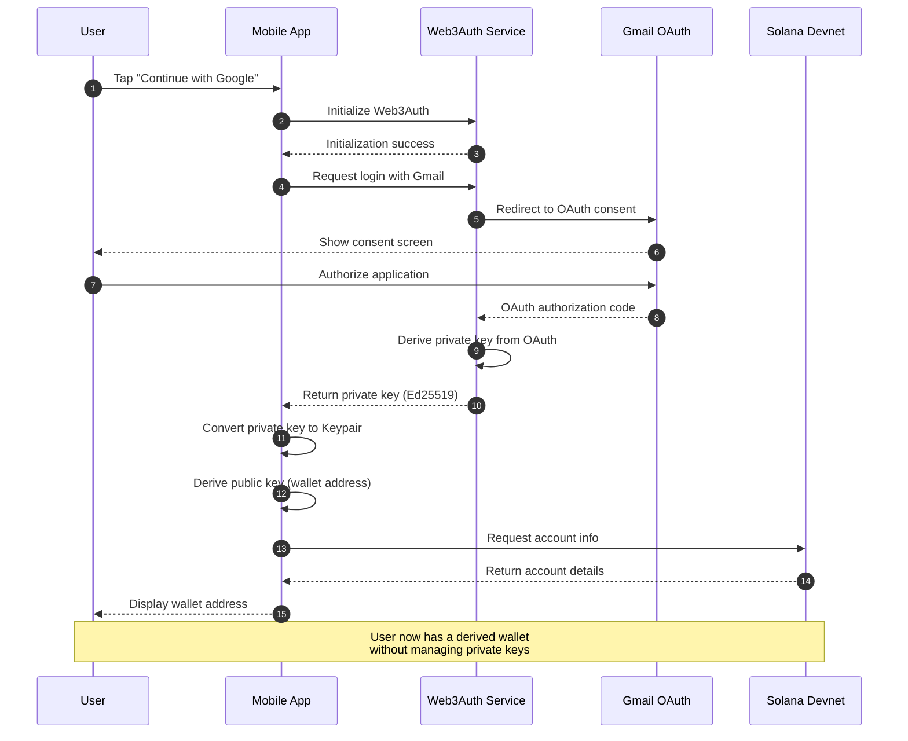
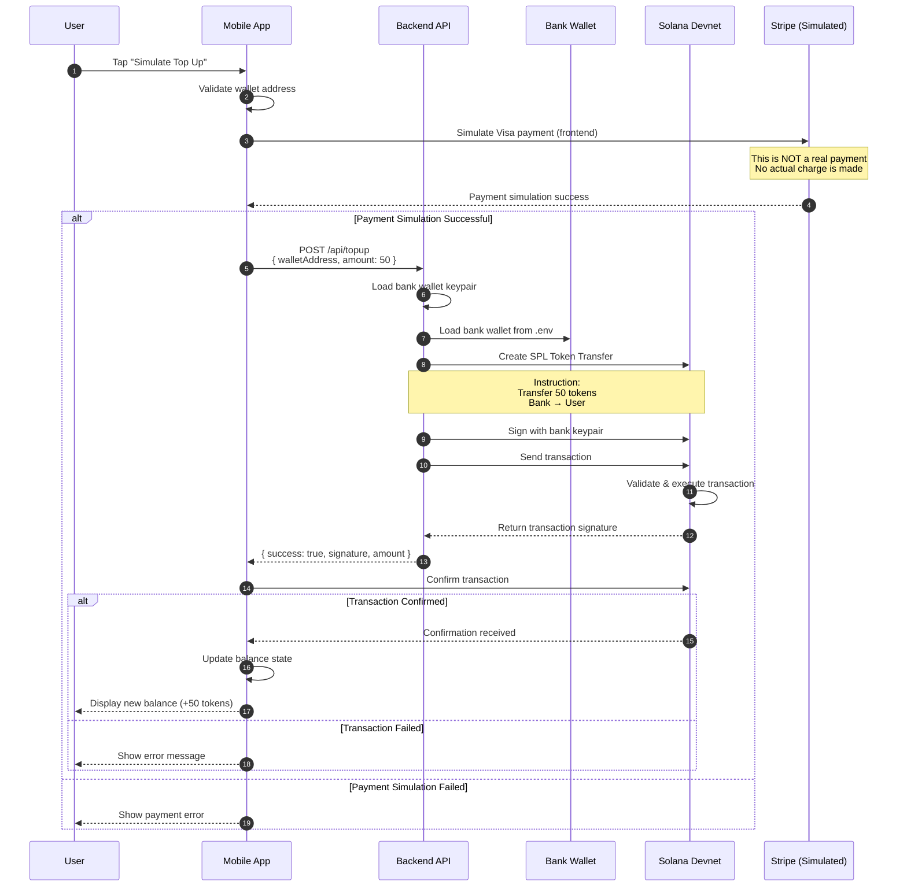
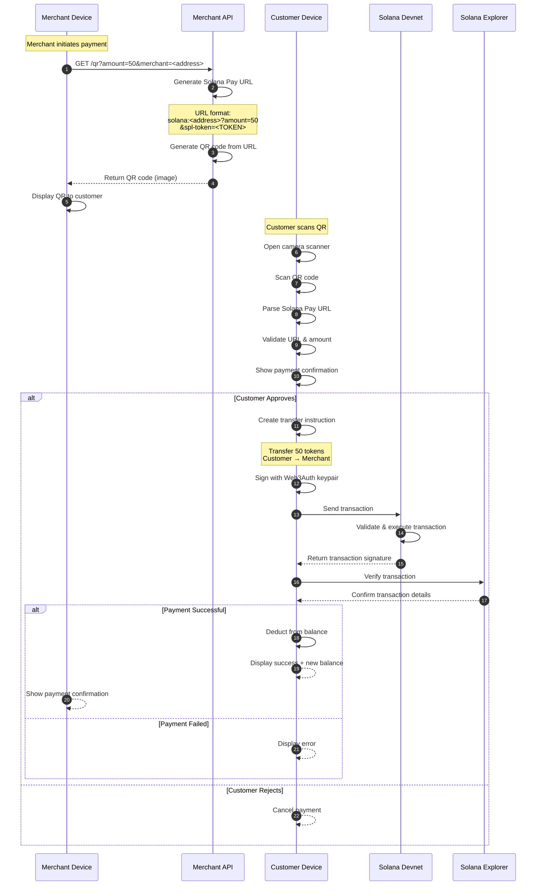
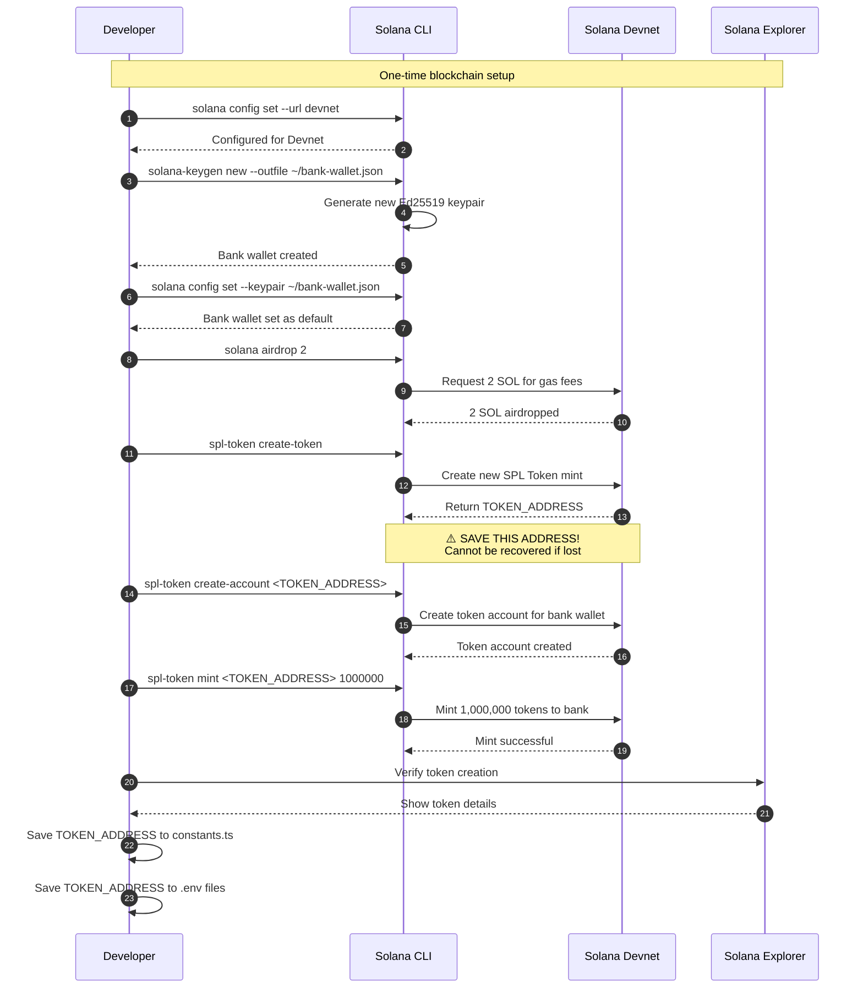

# Sequence Diagrams

This document contains sequence diagrams for all key user flows in the DCWLT application.

## Table of Contents

1. [Gmail Authentication Flow](#1-gmail-authentication-flow)
2. [Simulated Visa Top-Up Flow](#2-simulated-visa-top-up-flow)
3. [QR Payment Flow](#3-qr-payment-flow)
4. [Token Creation Flow](#4-token-creation-flow)

---

## 1. Gmail Authentication Flow

The authentication flow derives a Solana wallet from the user's Gmail account using Web3Auth.



### Key Points

- **Private Key Security**: Private key is derived by Web3Auth and never exposed to the app
- **Non-Custodial**: User maintains full control of their wallet
- **Recovery**: Lost wallets can be recovered by re-authenticating with Gmail

---

## 2. Simulated Visa Top-Up Flow

The top-up flow simulates a Visa card payment by transferring Event Tokens from the bank wallet.



### Key Points

- **No Real Money**: Stripe integration is simulated; no actual charges occur
- **Instant Transfer**: Tokens transfer immediately on Solana Devnet
- **Bank Wallet**: Holds all Event Tokens and dispenses them during top-ups
- **Verification**: Transaction can be verified on Solana Explorer

---

## 3. QR Payment Flow

The payment flow allows users to scan merchant QR codes and pay with Event Tokens.



### Key Points

- **Solana Pay**: Uses the Solana Pay URL standard for QR codes
- **Instant Settlement**: Payment confirmation in seconds
- **Reference Tracking**: Each payment includes a unique reference ID
- **Merchant Verification**: Merchants can verify payments on the blockchain

---

## 4. Token Creation Flow

The one-time setup flow for creating the Event Token on Solana Devnet.



### Key Points

- **One-Time Setup**: Token creation only happens once
- **Token Address**: Must be saved to constants and .env files
- **Bank Wallet**: Holds the entire initial token supply
- **Devnet SOL**: Free SOL is available for gas fees on Devnet

---

## Solana Pay URL Format

All merchant QR codes use the Solana Pay URL format:

```
solana:<MERCHANT_ADDRESS>?amount=<AMOUNT>&spl-token=<TOKEN_ADDRESS>&reference=<REFERENCE>&label=<LABEL>&message=<MESSAGE>
```

### Parameters

| Parameter | Required | Description | Example |
|-----------|----------|-------------|---------|
| `MERCHANT_ADDRESS` | Yes | Merchant's Solana public key | `7xKXtg2CW87d97TXJSDpbD5jBkheTqA83TZRuJosgAsU` |
| `amount` | Yes | Payment amount | `50` |
| `spl-token` | Yes | Event Token mint address | `YourTokenMintAddress` |
| `reference` | No | Unique transaction reference (UUID) | `550e8400-e29b-41d4-a716-446655440000` |
| `label` | No | Display name for merchant | `Merchant` |
| `message` | No | Payment description | `Payment for goods` |

### Example URL

```
solana:7xKXtg2CW87d97TXJSDpbD5jBkheTqA83TZRuJosgAsU?amount=50&spl-token=YourTokenMintAddress&reference=550e8400-e29b-41d4-a716-446655440000&label=Merchant&message=Payment
```

---

## Transaction States

### Top-Up Transaction States

```
┌─────────────┐    ┌─────────────┐    ┌─────────────┐    ┌─────────────┐
│   Request   │───>│ Processing  │───>│  Pending    │───>│ Confirmed   │
│  Received   │    │ (Signing)   │    │ (On-chain)  │    │  (Success)  │
└─────────────┘    └─────────────┘    └─────────────┘    └─────────────┘
       │                   │                   │                   │
       v                   v                   v                   v
   Invalid           Signing Failed      Transaction       Balance Updated
   Request           Failed              Failed
```

### Payment Transaction States

```
┌─────────────┐    ┌─────────────┐    ┌─────────────┐    ┌─────────────┐
│  QR Scanned │───>│ User Review │───>│  Approved   │───>│ Confirmed   │
│             │    │  (Confirm)  │    │ (Signing)   │    │  (Success)  │
└─────────────┘    └─────────────┘    └─────────────┘    └─────────────┘
       │                   │                   │                   │
       v                   v                   v                   v
   Invalid             User Declined      Signing Failed      Balance Deducted
   QR Code                                 Failed
```

---

## Error Handling

### Common Error Scenarios

| Error | Cause | Resolution |
|-------|-------|------------|
| Invalid wallet address | Malformed public key | Validate Base58 format |
| Transaction timeout | Network congestion | Retry after 30 seconds |
| Insufficient funds | Bank wallet empty | Airdrop more tokens |
| Invalid signature | Signing error | Re-authenticate with Web3Auth |

---

## Security Considerations

### Web3Auth Security
- Private keys are derived server-side by Web3Auth
- App never receives raw private keys
- Keys are reconstructed in secure memory only

### Blockchain Security
- All transactions are signed locally
- No private keys leave the device
- Transactions are verifiable on Solana Explorer

### API Security (POC Limitations)
- No authentication implemented
- No rate limiting
- No input validation beyond basic checks
- **Production**: Implement API keys, rate limiting, and full validation
