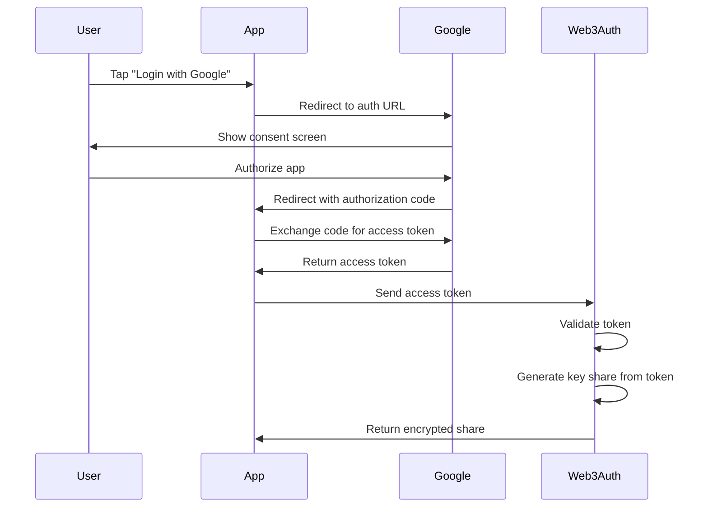

# Cryptography Primer for DCWLT

An educational guide to the cryptographic concepts that secure the DCWLT wallet.

## Table of Contents

- [Introduction](#introduction)
- [Hash Functions](#hash-functions)
- [Public Key Cryptography](#public-key-cryptography)
- [Digital Signatures](#digital-signatures)
- [Ed25519: Solana's Signature Scheme](#ed25519-solanas-signature-scheme)
- [Shamir's Secret Sharing](#shamirs-secret-sharing)
- [OAuth Security](#oauth-security)
- [Blockchain Cryptography](#blockchain-cryptography)
- [Common Cryptographic Attacks](#common-cryptographic-attacks)

---

## Introduction

Cryptography is the mathematics of secure communication. In DCWLT, cryptography ensures:

- **Confidentiality**: Private keys remain secret
- **Integrity**: Transactions cannot be tampered with
- **Authentication**: Prove you own a wallet
- **Non-repudiation**: Cannot deny authorizing a transaction

### Why Cryptography Matters

```
Without Cryptography:
- Anyone can spend anyone's funds
- Transactions can be altered
- No way to prove ownership
- Trust in central authority required

With Cryptography:
- Only private key holder can spend
- Transactions are immutable
- Ownership is mathematically provable
- Trust minimized through mathematics
```

---

## Hash Functions

### What is a Hash Function?

A hash function is a **one-way mathematical function** that:

```python
def hash_function(data):
    # Takes input of any size
    # Produces fixed-size output
    # One-way: Cannot reverse to find input
    # Deterministic: Same input = same output
    return fixed_size_output
```

### Example: SHA-256

```python
import hashlib

# Hash a simple message
message = "Hello, DCWLT!"
hash_result = hashlib.sha256(message.encode()).hexdigest()

# Result: 64 hexadecimal characters (256 bits)
# "a3b5c7d9e1f2...89"
```

**Properties**:

1. **Deterministic**
```python
hash("Hello")  # Always produces: 185f8db...
hash("Hello")  # Always produces: 185f8db...
```

2. **Pre-image resistant** (One-way)
```python
# Given hash, impossible to find original message
hash_value = "185f8db32271fe25f561a6fc938b2e264306ec304eda518007d1764826381969"
# Cannot compute: hash⁻¹(hash_value) = "Hello"
```

3. **Collision resistant**
```python
# Extremely difficult to find two different messages with same hash
hash("Message1") ≠ hash("Message2")  # With overwhelming probability
```

4. **Avalanche effect**
```python
# Tiny change in input = completely different hash
hash("Hello")  # 185f8db32271...
hash("HellO")  # 334d016f755cd... (completely different!)
```

### Why This Matters for Wallets

```typescript
// Private keys are never derived from hashes in production
// But hash functions are used throughout the system

// Example: Generating wallet address from public key
const address = createHash('sha256')
  .update(publicKey)
  .digest('hex')
  .slice(0, 44);  // Base58 encoded
```

---

## Public Key Cryptography

### The Problem

How do two parties communicate securely without first sharing a secret?

**Traditional (Symmetric) Encryption**:
```
Alice and Bob share secret key K
Alice encrypts with K → Bob decrypts with K
❌ Problem: How do they agree on K securely?
```

**Public Key (Asymmetric) Encryption**:
```
Alice has key pair (private_A, public_A)
Bob has key pair (private_B, public_B)

Alice encrypts with public_B → Bob decrypts with private_B
✅ No secret sharing required!
```

### Key Pair Mathematics

Each wallet has a **key pair**:

```
┌─────────────────────────────────────────┐
│            Wallet Key Pair               │
├─────────────────────────────────────────┤
│                                         │
│  Private Key (Secret)                   │
│  ┌─────────────────────────────────┐   │
│  │ 7xKXtg2CW87d97TXJSDpbD5jBk...   │   │
│  │ 🔒 KEEP SECRET!                  │   │
│  │ 🔒 NEVER SHARE!                  │   │
│  └─────────────────────────────────┘   │
│                                         │
│         ↓ (Mathematical relation)       │
│                                         │
│  Public Key (Share Freely)              │
│  ┌─────────────────────────────────┐   │
│  │ 7xKXtg2CW87d97TXJSDpbD5jBk...   │   │
│  │ ✅ Safe to share                 │   │
│  │ ✅ Your wallet address           │   │
│  └─────────────────────────────────┘   │
│                                         │
└─────────────────────────────────────────┘
```

### The Critical Property

**It's computationally infeasible** to derive the private key from the public key.

```
Mathematically:
public_key = F(private_key)

But:
private_key = F⁻¹(public_key)  ❌ Practically impossible!

Why? Because F is a "trapdoor function" - easy one way,
practically impossible to reverse.
```

### Elliptic Curve Cryptography (ECC)

Solana (and Bitcoin, Ethereum) use ECC for key generation:

```python
# Simplified representation
# Private key: Random number (256 bits)
private_key = random_integer(1, 2^256)

# Public key: Point on elliptic curve
# G is a "generator point" on the curve
public_key = private_key * G

# The * is elliptic curve point multiplication
# It's a trapdoor function!
```

**Why ECC?**

| Aspect | RSA (Traditional) | ECC (Modern) |
|--------|-------------------|--------------|
| Key Size | 2048 bits | 256 bits |
| Speed | Slower | Faster |
| Security | Equivalent | Equivalent |

---

## Digital Signatures

### The Problem

How do I prove I authorized a transaction without revealing my private key?

**Solution**: Digital Signatures

### How Digital Signatures Work

```
┌─────────────────────────────────────────────────────────────┐
│                 Digital Signature Process                    │
├─────────────────────────────────────────────────────────────┤
│                                                             │
│  1. Message (Transaction)                                   │
│     │                                                        │
│     v                                                        │
│  2. Sign with Private Key                                   │
│     │                                                        │
│     v                                                        │
│  3. Signature (Mathematical proof)                          │
│     │                                                        │
│     v                                                        │
│  4. Anyone can verify with Public Key                       │
│                                                             │
└─────────────────────────────────────────────────────────────┘
```

### Signing Process

```typescript
// 1. Create transaction
const transaction = {
  from: "7xKXtg2CW87d97TXJSDpbD5jBkheTqA83TZRuJosgAsU",
  to: "9xKXtg2CW87d97TXJSDpbD5jBkheTqA83TZRuJosgAsV",
  amount: 50,
  nonce: 12345,
};

// 2. Sign with private key (SECRET!)
const signature = sign(privateKey, transaction);
// Produces: "3BZY2qPyno3JjqvNZKQiPG8DVSSvgfMRdKdqcKZmNfVhGNrF6S..."

// 3. Share transaction + signature publicly
broadcast({
  transaction,
  signature,
  publicKey: "7xKXtg2CW87d97TXJSDpbD5jBkheTqA83TZRuJosgAsU"
});
```

### Verification Process

```typescript
// Anyone on the network can verify:

function verifySignature(publicKey, transaction, signature) {
  // This uses ONLY public information
  return verify(publicKey, transaction, signature);
}

// Returns: true or false
// true = Transaction definitely signed by private key owner
// false = Signature is fake or tampered
```

### Properties of Digital Signatures

✅ **Authentication**: Proves who signed
✅ **Integrity**: Detects any tampering
✅ **Non-repudiation**: Signer cannot deny signing
✅ **No Private Key Exposure**: Signature reveals nothing about private key

---

## Ed25519: Solana's Signature Scheme

### What is Ed25519?

Ed25519 is a modern digital signature scheme used by Solana:

- **Ed**: Edwards-curve Digital Signature
- **25519**: Based on Curve25519 elliptic curve

### Why Ed25519?

```python
# Comparison of signature schemes

RSA-2048:
- Key size: 2048 bits (256 bytes)
- Signature size: 256 bytes
- Speed: Slow
- Security: Good but aging

ECDSA (Bitcoin, Ethereum):
- Key size: 256 bits (32 bytes) uncompressed 64 bytes
- Signature size: ~64 bytes
- Speed: Medium
- Security: Good

Ed25519 (Solana):
- Key size: 256 bits (32 bytes)
- Signature size: 64 bytes
- Speed: Very fast
- Security: Excellent (128-bit security)
```

### Ed25519 in Action

```typescript
import { Keypair } from '@solana/web3.js';

// Generate key pair
const keypair = Keypair.generate();

// Private key: 64 bytes
// - 32 bytes: seed
// - 32 bytes: public key (for convenience)
console.log('Private key:', keypair.secretKey);  // 64 bytes

// Public key: 32 bytes (Base58 encoded)
console.log('Public key:', keypair.publicKey.toBase58());  // 44 chars

// Sign message
const message = new TextEncoder().encode('Hello, Solana!');
const signature = keypair.sign(message);

// Signature: 64 bytes
console.log('Signature:', signature.signature);  // 64 bytes
```

### Ed25519 Security Properties

1. **Deterministic**
```typescript
// Same message, same private key = same signature
const sig1 = keypair.sign(message);
const sig2 = keypair.sign(message);
// sig1 === sig2  (unlike some other schemes)
```

2. **Collision Resistant**
```typescript
// Practically impossible to find two messages
// that produce the same signature
```

3. **Batch Verification**
```typescript
// Can verify many signatures at once for efficiency
const isValid = verifyBatch([sig1, sig2, sig3], [pub1, pub2, pub3]);
```

---

## Shamir's Secret Sharing

### The Problem

How do you split a secret so that:
- No single person knows the full secret
- But the group can reconstruct it together?

### The Solution: Shamir's Secret Sharing

```python
# Original secret
S = "My private key"

# Split into 3 shares, need any 2 to reconstruct
shares = shamir_split(S, n=3, k=2)

# Result:
# share_1 = "part of secret"
# share_2 = "part of secret"
# share_3 = "part of secret"
#
# Any 2 shares can reconstruct S
# Any 1 share reveals nothing about S
```

### How It Works (Simplified)

Shamir's Secret Sharing uses **polynomial interpolation**:

```
┌─────────────────────────────────────────────────────────────┐
│                    Mathematical Concept                      │
├─────────────────────────────────────────────────────────────┤
│                                                             │
│  Secret: S (the y-intercept)                                │
│                                                             │
│  Create polynomial:                                         │
│  f(x) = S + a₁x + a₂x² + ... + aₖ₋₁xᵏ⁻¹                     │
│                                                             │
│  Choose random points:                                      │
│  (1, f(1)), (2, f(2)), (3, f(3)), ..., (n, f(n))           │
│                                                             │
│  Each point is a "share"                                    │
│                                                             │
│  Any k points can reconstruct the polynomial (and S)        │
│  Fewer than k points reveal nothing                         │
│                                                             │
└─────────────────────────────────────────────────────────────┘
```

### Visual Example

```
Polynomial: f(x) = S + 5x + 3x²

If S (secret) = 10:
f(x) = 10 + 5x + 3x²

Shares (points on curve):
Share 1: (1, 18)   f(1) = 10 + 5(1) + 3(1)² = 18
Share 2: (2, 32)   f(2) = 10 + 5(2) + 3(2)² = 32
Share 3: (3, 52)   f(3) = 10 + 5(3) + 3(3)² = 52

Given any 2 shares:
Can reconstruct the polynomial
Can find S = f(0) = 10

Given only 1 share:
Cannot determine S (infinite possibilities)
```

### Web3Auth Implementation

```typescript
// Web3Auth uses 2-of-2 Shamir's Secret Sharing

const threshold = 2;  // Need 2 shares
const totalShares = 2;  // Total 2 shares generated

// Share 1: Derived from OAuth token (stored on device)
const share1 = deriveShareFromOAuth(oauthToken);

// Share 2: Retrieved from Web3Auth servers (encrypted)
const share2Encrypted = await web3authAPI.getEncryptedShare();
const share2 = decrypt(share2Encrypted, oauthToken);

// Reconstruct private key
const privateKey = shamirCombine([share1, share2]);
```

**Why This Is Secure**:

1. **Server Compromise**: Attacker gets encrypted share 2, but needs OAuth token
2. **Device Theft**: Attacker gets share 1, but needs encrypted share 2 from server
3. **OAuth Compromise**: Attacker can generate share 1, but needs share 2

All three must happen simultaneously to compromise the key.

---

## OAuth Security

### What is OAuth?

OAuth (Open Authorization) is an open standard for access delegation.

### The OAuth Flow



### Why OAuth Is Secure

#### 1. **Token Issuance**

```python
# Google's servers issue cryptographically signed tokens
access_token = jwt.encode({
  "iss": "https://accounts.google.com",
  "aud": "client_id_from_web3auth",
  "sub": "user_id_123",
  "email": "user@gmail.com",
  "exp": current_time + 3600,  # Expires in 1 hour
}, google_private_key)  # Signed with Google's key

# Anyone can verify the signature
decoded = jwt.decode(access_token, google_public_key)
```

**Security Properties**:
- ✅ Signed by Google (cannot forge)
- ✅ Expires quickly (1 hour)
- ✅ Bound to specific app (client_id)
- ✅ Can be revoked by Google

#### 2. **HTTPS Everywhere**

```
All OAuth communication over HTTPS:
- Encryption prevents eavesdropping
- Certificate validation prevents MITM
- TLS 1.3 recommended
```

#### 3. **PKCE (Proof Key for Code Exchange)**

```typescript
// Additional security for public clients (mobile apps)

// Generate code verifier
const codeVerifier = base64URL(randomBytes(32));

// Derive code challenge
const codeChallenge = sha256(codeVerifier);

// Send challenge in auth request
const authURL = `https://accounts.google.com/o/oauth2/v2/auth?code_challenge=${codeChallenge}`;

// Send verifier in token exchange
const token = await exchangeCode(code, codeVerifier);
```

**Why PKCE?** Prevents authorization code interception attacks.

---

## Blockchain Cryptography

### Merkle Trees (Data Integrity)

Solana (and other blockchains) use Merkle trees to verify transaction data:

```
                    Root Hash
                   /          \
              Hash AB        Hash CD
             /      \       /      \
         Hash A   Hash B  Hash C  Hash D
           |        |       |        |
         TX A     TX B    TX C     TX D
```

**Properties**:
- Changing any transaction changes all hashes up to root
- Root hash commits to all transactions
- Efficient verification (O(log n))

### Transaction Hashing

```typescript
import { sha256 } from 'crypto-hash';

// Solana transaction ID is SHA-256 of transaction data
const transactionId = sha256(transaction.serialize());

// This ensures:
// 1. Unique ID for each transaction
// 2. Tamper-evident (any change = different hash)
// 3. Deterministic (same tx = same hash)
```

### Block Confirmation

```typescript
// PoH (Proof of History) in Solana
const sequence = [
  hash(prevHash + "tx1"),
  hash(prevHash + "tx2"),
  hash(prevHash + "tx3"),
  // ...
];

// Each hash depends on previous hash
// Creates verifiable timeline
```

---

## Common Cryptographic Attacks

### 1. Brute Force Attack

**Attack**: Try every possible private key

**Why It Fails**:
```python
# Private key space: 2^256 possibilities
# Even with billions of attempts per second:

time_to_crack = (2^256) / (1 billion * seconds_in_year)
# ≈ 10^60 years (longer than age of universe)
```

### 2. Birthday Attack

**Attack**: Find two inputs with same hash

**Mitigation**: Use large hash output (256 bits)

```python
# Birthday paradox
# Probability of collision in 2^128 attempts ≈ 50%
# But 2^128 is still astronomically large
```

### 3. Replay Attack

**Attack**: Capture valid transaction and resubmit

**Mitigation in Solana**:
```typescript
// Each transaction includes:
// 1. Recent blockhash (expires)
// 2. Nonce (unique per account)
// 3. Once confirmed, signature cannot be reused
```

### 4. Man-in-the-Middle Attack

**Attack**: Intercept and modify communication

**Mitigation**:
```typescript
// HTTPS + Certificate Pinning
// All communication encrypted
// Server authenticated with certificates
```

### 5. Side-Channel Attack

**Attack**: Extract keys via timing, power analysis, etc.

**Mitigation**:
- Constant-time algorithms
- Secure enclaves (TEE)
- Hardware security modules (HSM)

---

## Practical Examples

### Example 1: Signing a Transaction

```typescript
import { Keypair, Transaction, SystemProgram } from '@solana/web3.js';

// 1. Generate key pair
const keypair = Keypair.generate();

// 2. Create transaction
const transaction = new Transaction().add(
  SystemProgram.transfer({
    fromPubkey: keypair.publicKey,
    toPubkey: recipientPublicKey,
    lamports: 1000,
  })
);

// 3. Sign (private key used here, never leaves device)
const signature = keypair.sign(transaction);

// 4. Verify (anyone can do this with public key)
const isValid = require('crypto').verify(
  'sha256',
  transaction.serializeMessage(),
  keypair.publicKey.toBytes(),
  signature.signature
);

console.log('Signature valid:', isValid);  // true
```

### Example 2: Verifying a Signature

```typescript
// Someone claims they signed a message
// You can verify with their public key

function verifyTransaction(publicKey, transaction, signature) {
  // This uses ONLY public information
  return signature.verify(
    publicKey,
    transaction.serializeMessage()
  );
}

// Example usage
const claimedSignature = "3BZY2qPyn...";
const transaction = /* transaction data */;
const publicKey = "7xKXtg2CW87...";

const isValid = verifyTransaction(publicKey, transaction, claimedSignature);

if (isValid) {
  console.log("✅ Signature valid - transaction authorized!");
} else {
  console.log("❌ Signature invalid - someone is lying!");
}
```

---

## Key Takeaways

1. **Private keys are never shared** - They're used for signing only
2. **Public keys are safe to share** - They're your wallet address
3. **Signatures prove ownership** - Without revealing private keys
4. **Hash functions are one-way** - Cannot reverse to find input
5. **OAuth tokens are secure** - Signed by Google, expire quickly
6. **Shamir's Secret Sharing** - Splits secrets, requires multiple parts
7. **Ed25519 is modern and secure** - Used by Solana for performance

---

## Further Learning

### Interactive Tools

- [Key Generation Demo](https://github.com/FlowCrypt/policy)
- [Digital Signature Explained](https://www.debugger.com/)
- [Hash Function Visualizer](https://passwordsgenerator.net/sha256-hash-generator/)

### Books

- "Introduction to Modern Cryptography" by Katz & Lindell
- "Applied Cryptography" by Bruce Schneier
- "The Code Book" by Simon Singh (accessible intro)

### Online Courses

- [Coursera: Cryptography I](https://www.coursera.org/learn/cryptography)
- [Khan Academy: Cryptography](https://www.khanacademy.org/computing/computer-science/cryptography)
- [Crypto101](https://www.crypto101.io/)

### Research Papers

- [Ed25519: High-speed high-security signatures](https://ed25519.cr.yp.to/)
- [RFC 8032: EdDSA](https://www.rfc-editor.org/rfc/rfc8032)
- [Shamir's Secret Sharing](https://dl.acm.org/doi/10.1145/359168.359176)

---

Remember: **Don't roll your own crypto!** Use battle-tested libraries like:
- `@solana/web3.js`
- `@web3auth/sdk`
- `crypto` (Node.js built-in)
- `tweetnacl` (portable cryptography)
