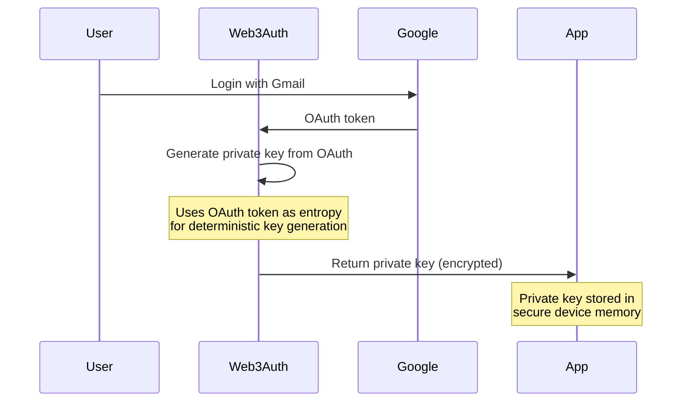
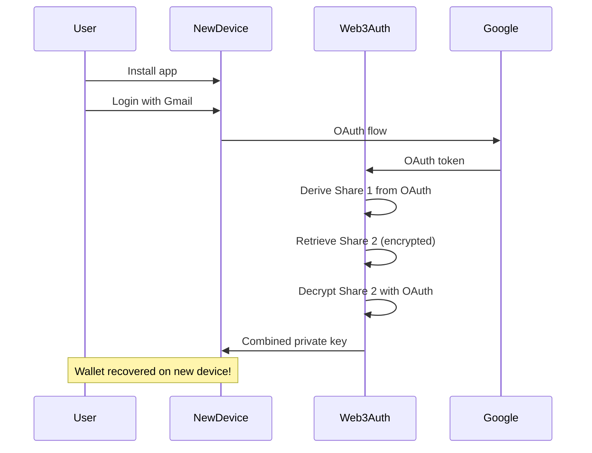

# Wallet Security Documentation

This document explains how DCWLT protects user private keys and wallet security. Understanding these concepts is critical for anyone building or using cryptocurrency wallet applications.

## Table of Contents

- [Executive Summary](#executive-summary)
- [Threat Model](#threat-model)
- [Private Key Protection](#private-key-protection)
- [Web3Auth Security Architecture](#web3auth-security-architecture)
- [Transaction Security](#transaction-security)
- [Data Storage Security](#data-storage-security)
- [Network Security](#network-security)
- [Attack Prevention](#attack-prevention)
- [Security Best Practices](#security-best-practices)
- [Known Limitations](#known-limitations)

---

## Executive Summary

DCWLT implements a **non-custodial** wallet architecture where users maintain full control of their private keys. The system uses Web3Auth for social login-based key generation, ensuring:

✅ Private keys never leave the user's device
✅ No seed phrases to manage or lose
✅ Keys can be recovered using Gmail authentication
✅ All transactions are signed locally
✅ No central server holds user funds

### Security Guarantees

| Guarantee | Implementation |
|-----------|----------------|
| **Key Sovereignty** | Private keys derived device-side from OAuth |
| **Non-Custodial** | Server never sees private keys |
| **Recoverability** | Keys regenerated from Gmail login |
| **Transaction Integrity** | Local signing before blockchain submission |
| **Auditability** | All transactions verifiable on Solana Explorer |

---

## Threat Model

### What We Protect Against

| Threat | Protection | Status |
|--------|-----------|--------|
| Server compromise revealing keys | Keys never on server | ✅ Protected |
| Device theft exposing keys | OS-level encryption required | ⚠️ User responsibility |
| Phishing attacks | OAuth flow validation | ⚠️ User awareness needed |
| Man-in-the-middle attacks | HTTPS + certificate pinning | ⚠️ POC: HTTPS only |
| Malicious app updates | Code signing verification | ⚠️ Future enhancement |
| Replay attacks | Nonce + recent blockhash | ✅ Protected by Solana |
| Clipboard hijacking | In-app transaction building | ✅ Protected |

### What We Don't Protect Against

| Threat | Mitigation |
|--------|------------|
| **Device compromise** | If malware gains device access, keys could be extracted. Mitigation: Use secure devices, avoid rooted/jailbroken phones |
| **Social engineering** | If user is tricked into signing malicious transactions. Mitigation: User education, clear transaction displays |
| **Gmail account compromise** | If attacker accesses Gmail, they can derive the wallet. Mitigation: Enable 2FA on Gmail |
| **Physical device theft** | If phone is stolen and unlocked. Mitigation: Device PIN, biometric authentication |

---

## Private Key Protection

### The Security Challenge

**Traditional Wallets** require users to manage seed phrases:
```
waffle toast dinosaur jungle pill sudden gym survey
```

**Problems**:
- Users lose seed phrases → funds lost forever
- Users store seed phrases unsafely → theft
- Users don't understand seed phrases → poor UX

**DCWLT Solution**: Derive keys from Gmail OAuth

### Key Generation Flow



### Why This Is Secure

#### 1. **Deterministic Key Generation**

The private key is **mathematically derived** from the OAuth token:

```typescript
// Simplified (actual Web3Auth is more complex)
function derivePrivateKey(oauthToken: string): PrivateKey {
  // Use OAuth token as entropy source
  const hash = sha256(oauthToken + "web3auth-salt");
  return new Ed25519Keypair(hash);
}
```

**Security Properties**:
- ✅ **Reproducible**: Same Gmail login → same private key
- ✅ **Unpredictable**: Without OAuth token, cannot derive key
- ✅ **One-way**: Cannot reverse-engineer OAuth from private key

#### 2. **OAuth Token Security**

Google OAuth tokens are:
- Issued by Google's secure servers
- Signed with Google's private keys
- Have short expiration (typically 1 hour)
- Transported over HTTPS
- Bound to specific app client ID

**Attack Scenario**: Can attacker intercept OAuth token?

**Protection**: HTTPS + OAuth flow validation makes this extremely difficult.

#### 3. **No Server-Side Key Storage**

```
┌─────────────────────────────────────────────────────────────┐
│                    Traditional Custodial Wallet              │
├─────────────────────────────────────────────────────────────┤
│  User → Server holds private key → Server controls funds     │
│                                                             │
│  ❌ Server hack = All funds stolen                          │
│  ❌ Server shutdown = Funds inaccessible                    │
└─────────────────────────────────────────────────────────────┘

┌─────────────────────────────────────────────────────────────┐
│                    DCWLT Non-Custodial Wallet                │
├─────────────────────────────────────────────────────────────┤
│  User → Device holds private key → User controls funds      │
│                                                             │
│  ✅ Server hack = No keys to steal                          │
│  ✅ Server offline = Users unaffected                       │
└─────────────────────────────────────────────────────────────┘
```

#### 4. **Secure Memory Storage**

Private keys in DCWLT are stored in:

```typescript
// Web3Auth manages secure storage
const { privateKey } = await web3auth.connect();

// Key is stored in:
// - iOS: Keychain (encrypted with device passcode)
// - Android: Encrypted SharedPreferences (Android KeyStore)
// - Never in plain text files
// - Never in app logs
// - Never in crash reports
```

**Security Comparison**:

| Storage Method | Security | Used By DCWLT |
|----------------|----------|---------------|
| Plain file | ❌ Insecure | ❌ No |
| SharedPrefs (Android) | ❌ Insecure | ❌ No |
| AsyncStorage (React Native) | ⚠️ Risky | ❌ No |
| Keychain (iOS) | ✅ Secure | ✅ Yes |
| Android KeyStore | ✅ Secure | ✅ Yes |
| Secure Enclave (iOS) | ✅✅ Most Secure | ⚠️ Future |

---

## Web3Auth Security Architecture

### What is Web3Auth?

Web3Auth is a **non-custodial** authentication infrastructure that:

1. **Replaces** seed phrases with social logins
2. **Generates** private keys device-side
3. **Never sees** or stores user private keys
4. **Enables** key recovery through social login

### How Web3Auth Works

#### Architecture Overview

```
┌─────────────────────────────────────────────────────────────┐
│                        Web3Auth Layer                        │
├─────────────────────────────────────────────────────────────┤
│                                                             │
│  ┌─────────────┐      ┌──────────────┐      ┌───────────┐ │
│  │   Social    │─────>│   OAuth      │─────>│  Device   │ │
│  │   Login     │      │   Provider   │      │ Key Gen   │ │
│  └─────────────┘      └──────────────┘      └───────────┘ │
│                              │                               │
│                              v                               │
│                     ┌──────────────┐                        │
│                     │  Web3Auth    │                        │
│                     │  Servers     │                        │
│                     │  (Metadata)  │                        │
│                     └──────────────┘                        │
│                                                             │
└─────────────────────────────────────────────────────────────┘
```

#### Key Generation Process

```typescript
// 1. User authenticates with Google
const googleToken = await google.signIn();

// 2. Web3Auth SDK receives OAuth token
// 3. Web3Auth computes secret share from OAuth
const share1 = deriveShare1(googleToken);  // Device share

// 4. Web3Auth retrieves encrypted second share from server
const share2Encrypted = await web3authAPI.getShare(userId);
const share2 = decrypt(share2Encrypted, googleToken);

// 5. Combine shares to reconstruct private key
const privateKey = shamirSecretSharing.combine([share1, share2]);

// 6. Private key NEVER leaves device
```

### Why This Is Secure

#### 1. **Shamir's Secret Sharing**

Private key is split into **multiple parts** (shares):

```
Original Private Key: [████████████████████████]
                          │
                          ├─> Share 1 (Device): [████░░░░░░]
                          │
                          └─> Share 2 (Server): [░░░░░░░████]
```

**Properties**:
- ✅ **Need both shares** to reconstruct key
- ✅ **Individual share useless** on its own
- ✅ **Server share encrypted** with OAuth-derived key
- ✅ **Device share never leaves** device

#### 2. **OAuth as Encryption Key**

The server's share is encrypted using a key derived from the OAuth token:

```typescript
// Simplified representation
const encryptionKey = PBKDF2(oauthToken, salt, 100000);
const serverShareEncrypted = AES.encrypt(serverShare, encryptionKey);
```

**Security Implications**:
- ✅ Server cannot decrypt share without OAuth token
- ✅ OAuth token expires after 1 hour
- ✅ Attacker needs both server access AND user's Gmail session

#### 3. **Metadata vs. Private Keys**

Web3Auth servers store:
- ✅ **Encrypted shares** (useless without OAuth)
- ✅ **Metadata** (user ID, public keys)
- ❌ **NEVER private keys**

Even if Web3Auth servers are completely compromised:
- ❌ Attacker gets encrypted shares
- ❌ Attacker cannot decrypt without OAuth tokens
- ❌ Attacker cannot access user funds

### Recovery Mechanism

**Problem**: If user loses device, how do they recover wallet?

**Solution**: Re-authenticate with Gmail



**Why This Works**:
- Share 1 is deterministic from OAuth (same Gmail = same Share 1)
- Share 2 is stored encrypted on Web3Auth servers
- Same OAuth token can decrypt Share 2
- Combined shares reconstruct same private key

---

## Transaction Security

### Local Signing

All transactions are signed **locally on the device**:

```typescript
// 1. Create transaction locally
const transaction = new Transaction()
  .add(SystemProgram.transfer({
    fromPubkey: userKeypair.publicKey,
    toPubkey: merchantAddress,
    lamports: amount * 1e9,
  }));

// 2. Sign with private key (NEVER leaves device)
const signature = userKeypair.sign(transaction);

// 3. Send signed transaction to blockchain
await connection.sendTransaction(transaction);
```

### Why This Is Secure

#### 1. **Private Key Never Exits Device**

```
┌─────────────────────────────────────────────────────────────┐
│                     Transaction Signing                     │
├─────────────────────────────────────────────────────────────┤
│                                                             │
│  1. Transaction created on device                          │
│  2. Private key signs transaction (local operation)         │
│  3. Signed transaction sent to network                      │
│                                                             │
│  ✅ Private key never transmitted                          │
│  ✅ Server never sees private key                           │
│  ✅ Only signature (public info) is sent                    │
│                                                             │
└─────────────────────────────────────────────────────────────┘
```

#### 2. **Cryptographic Signature**

The signature is **mathematically impossible** to forge without the private key:

```typescript
// Ed25519 signature algorithm
const signature = sign(privateKey, transaction);

// Verification (anyone can do this)
const isValid = verify(publicKey, transaction, signature);

// Signature properties:
// - Unique for each transaction
// - Cannot be forged without private key
// - Can be verified by anyone with public key
```

#### 3. **Replay Attack Protection**

Solana prevents replay attacks using:

```typescript
// 1. Recent blockhash (expires after ~2 minutes)
transaction.recentBlockhash = await connection.getLatestBlockhash();

// 2. Each signature is unique (even for same transaction)
// due to different blockhash each time

// 3. Once confirmed, signature cannot be reused
```

### Transaction Confirmation

```typescript
// 1. Send transaction
const signature = await connection.sendTransaction(transaction);

// 2. Wait for confirmation
const confirmation = await connection.confirmTransaction(signature);

// 3. Verify on blockchain
const txDetails = await connection.getTransaction(signature);
```

**Security Benefits**:
- ✅ Transactions verifiable on Solana Explorer
- ✅ Immutable blockchain record
- ✅ No possibility of server tampering

---

## Data Storage Security

### What Gets Stored

| Data Type | Location | Encrypted | Accessible by Server |
|-----------|----------|-----------|---------------------|
| Private Key | Device secure storage | ✅ Yes | ❌ No |
| Public Key | Server (metadata) | ❌ N/A | ✅ Yes |
| Transaction History | Blockchain | ❌ N/A | ✅ Yes |
| OAuth Token | Not persisted | N/A | ❌ No |
| Session Data | Device memory | ⚠️ In memory | ❌ No |

### Device-Specific Storage

#### iOS (Keychain Services)

```typescript
// Web3Auth uses iOS Keychain for private keys
const keychainItem = {
  kSecClass: kSecClassKey,
  kSecAttrApplicationTag: 'com.dcwlt.wallet.privateKey',
  kSecValueData: privateKey,
  kSecAttrAccessible: kSecAttrAccessibleWhenPasscodeSetThisDeviceOnly,
};
```

**Security Features**:
- ✅ Encrypted with hardware-backed key
- ✅ Accessible only when device is unlocked
- ✅ Never backed up to iCloud
- ✅ Erased on device reset

#### Android (Android KeyStore)

```typescript
// Web3Auth uses Android KeyStore
const keyGenSpec = KeyGenParameterSpec.Builder(
  "dcwlt_wallet_key",
  KeyProperties.PURPOSE_SIGN or KeyProperties.PURPOSE_VERIFY
)
  .setDigests(KeyProperties.DIGEST_SHA256)
  .setSignaturePaddings(KeyProperties.SIGNATURE_PADDING_RSA_PKCS1)
  .setUserAuthenticationRequired(true)
  .build();
```

**Security Features**:
- ✅ Hardware-backed keystore (TEE)
- ✅ Key extraction prevented
- ✅ Biometric authentication required
- ✅ Export blocked by hardware

### What DOESN'T Get Stored

❌ Private keys are **never** stored in:
- Plain text files
- App preferences (SharedPreferences, AsyncStorage)
- Server databases
- Logs or analytics
- Crash reports

❌ OAuth tokens are **never** stored:
- They're used once for key generation
- Expire after 1 hour
- Not persisted across app restarts

---

## Network Security

### HTTPS Everywhere

All network communication uses HTTPS:

```typescript
// Backend API
const response = await fetch('https://api.dcwlt.com/api/topup', {
  method: 'POST',
  headers: { 'Content-Type': 'application/json' },
  body: JSON.stringify({ walletAddress, amount }),
});

// Solana RPC
const connection = new Connection('https://api.devnet.solana.com');
```

**HTTPS Protection**:
- ✅ Encryption in transit
- ✅ Server authentication
- ✅ Tamper detection
- ⚠️ **POC Limitation**: Certificate pinning not implemented

### Future: Certificate Pinning

```typescript
// Production deployment should implement certificate pinning
import { pinning } from 'react-native-ssl-pinning';

const response = await fetch('https://api.dcwlt.com/api/topup', {
  method: 'POST',
  sslPinning: {
    certs: ['api_dcwlt_com_cert'],  // Only accept this certificate
  },
});
```

**Benefits**:
- ✅ Prevents man-in-the-middle attacks
- ✅ Ensures connecting to genuine server
- ✅ Detects compromised CAs

---

## Attack Prevention

### Common Wallet Attacks

#### 1. **Clipboard Hijacking**

**Attack**: Malware monitors clipboard for wallet addresses

**DCWLT Protection**: Addresses never copied to clipboard
```typescript
// DCWLT builds transactions in-app
// No copy-paste of addresses required
```

#### 2. **Screen Sharing Attacks**

**Attack**: Attacker sees sensitive info during screen share

**DCWLT Protection**:
```typescript
// Detect screen recording (iOS)
import { ScreenCapturePickerView } from 'expo-screen-capture';

// Blur sensitive content when screen sharing detected
<ScreenCapturePickerView onCaptureStart={hideSensitiveData} />
```

#### 3. **App Overlay Attacks**

**Attack**: Fake overlay app captures PIN or approves transactions

**DCWLT Protection** (Future):
```typescript
// Detect overlay apps
import { protectAgainstScreenCapture } from 'react-native-security';

// Block overlays when transaction is being signed
```

#### 4. **Supply Chain Attacks**

**Attack**: Malicious dependency steals private keys

**DCWLT Protection**:
```json
// package.json locked versions
{
  "dependencies": {
    "@solana/web3.js": "1.87.6",  // Exact version
    "@web3auth/react-native-sdk": "6.1.0"  // Exact version
  }
}
```

Plus:
```bash
# Run security audit
npm audit
# Check for vulnerabilities
npm audit fix
```

---

## Security Best Practices

### For Users

1. **Enable Gmail 2FA**
   - Your Gmail account controls wallet access
   - 2FA prevents account takeover

2. **Secure Your Device**
   - Set strong device PIN/passcode
   - Enable biometric authentication
   - Keep OS updated

3. **Avoid Rooted/Jailbroken Devices**
   - These devices have weaker security models
   - Malware can extract keys more easily

4. **Verify Transactions**
   - Always check recipient address
   - Verify amount before confirming
   - Use Solana Explorer to confirm

5. **Beware of Phishing**
   - Only download from official app stores
   - Never share your Gmail password
   - DCWLT will never ask for your seed phrase (you don't have one!)

### For Developers

1. **Never Log Private Keys**
```typescript
// ❌ NEVER do this
console.log('Private key:', privateKey);

// ✅ Use secure logging
logger.info('Wallet operation', { publicKey: keypair.publicKey });
```

2. **Validate All Inputs**
```typescript
// ✅ Always validate
if (!isValidAddress(walletAddress)) {
  throw new Error('Invalid wallet address');
}
```

3. **Use Secure Random**
```typescript
// ❌ Don't use Math.random()
const nonce = Math.random();

// ✅ Use crypto-secure random
import { randomBytes } from 'crypto';
const nonce = randomBytes(32);
```

4. **Implement Rate Limiting**
```typescript
// Prevent brute force attacks
import rateLimit from 'express-rate-limit';

const limiter = rateLimit({
  windowMs: 15 * 60 * 1000,  // 15 minutes
  max: 5,  // 5 attempts per window
});
```

5. **Keep Dependencies Updated**
```bash
# Regular updates
npm update

# Security audit
npm audit
npm audit fix
```

---

## Known Limitations (POC)

### Security Enhancements Needed

| Issue | Status | Production Fix |
|-------|--------|----------------|
| No certificate pinning | ⚠️ POC only | Implement SSL pinning |
| No biometric auth for tx | ⚠️ POC only | Require FaceID/Fingerprint |
| No screen sharing detection | ⚠️ POC only | Implement screen capture detection |
| No hardware wallet support | ⚠️ POC only | Add Ledger/Trezor integration |
| Simple rate limiting | ⚠️ POC only | Implement sophisticated rate limiting |
| No device integrity check | ⚠️ POC only | Add SafetyNet/Play Integrity |

### Server Security (Future)

For production deployment:

1. **API Authentication**
```typescript
// Implement API keys
app.use((req, res, next) => {
  const apiKey = req.headers['x-api-key'];
  if (!validateApiKey(apiKey)) {
    return res.status(401).json({ error: 'Unauthorized' });
  }
  next();
});
```

2. **Bank Wallet Security**
```typescript
// Use HSM/KMS for production
import { KMSClient, SignCommand } from '@aws-sdk/client-kms';

const signature = await kmsClient.send(new SignCommand({
  KeyId: 'bank-wallet-key-id',
  Message: transaction.serialize(),
  SigningAlgorithm: 'RSASSA_PSS_SHA_256',
}));
```

3. **DDoS Protection**
- Use Cloudflare or AWS Shield
- Implement rate limiting per IP
- Set up geoblocking if needed

---

## Security Comparison

### DCWLT vs Traditional Wallets

| Feature | Traditional Wallet | DCWLT (Web3Auth) |
|---------|-------------------|------------------|
| Key Management | Seed phrase | Social login |
| Recovery | Seed phrase backup | Gmail login |
| Custodial? | Non-custodial | Non-custodial |
| Server Access to Keys? | No | No |
| User Experience | Complex (seed phrases) | Simple (Gmail) |
| Single Point of Failure? | Yes (lost seed) | Yes (hacked Gmail) |
| Security Model | User responsibility | Shared (Google + device) |

### Security Trade-offs

**Advantages of Web3Auth**:
- ✅ Better UX (no seed phrases)
- ✅ Easier recovery (social login)
- ✅ Lower risk of user error

**Disadvantages**:
- ❌ Trust in Google account security
- ❌ Dependency on Web3Auth service
- ❌ Centralized point of failure (Google)

---

## Conclusion

DCWLT implements strong security fundamentals:

1. ✅ **Non-custodial**: Users control their funds
2. ✅ **Local signing**: Private keys never leave device
3. ✅ **OAuth security**: Industry-standard authentication
4. ✅ **Shamir's Secret Sharing**: Key material distributed
5. ✅ **Secure storage**: Hardware-backed key storage
6. ✅ **Blockchain verification**: All transactions auditable

### The Bottom Line

**DCWLT is as secure as**:
- Your Gmail account (enable 2FA!)
- Your device security (use strong PIN)
- Your operational security (don't install sketchy apps)

**DCWLT is NOT a replacement for**:
- Professional custody solutions
- Hardware wallets for large holdings
- Multi-sig setups for institutional funds

### Recommended Usage

✅ **Good for**:
- Daily spending (<$1000)
- Learning about crypto
- Testing and development
- Small-scale transactions

❌ **NOT recommended for**:
- Life savings
- Large holdings (>$10k)
- Institutional funds
- High-risk environments

---

## Further Reading

- [Web3Auth Security Whitepaper](https://web3auth.io/docs/security)
- [Solana Transaction Security](https://docs.solana.com/developing/programming-model/transactions)
- [Ed25519 Signature Scheme](https://ed25519.cr.yp.to/)
- [Shamir's Secret Sharing](https://en.wikipedia.org/wiki/Shamir%27s_secret_sharing)
- [OWASP Mobile Security](https://owasp.org/www-project-mobile-security/)

---

## Security Disclosure

If you discover a security vulnerability, please:

1. **DO NOT** create a public issue
2. **DO** email security@dcwlt.com (encrypted if possible)
3. **DO** include details and reproduction steps
4. **DO** allow 90 days for fix before disclosure

We will:
- Acknowledge receipt within 48 hours
- Provide timeline for fix
- Credit you in security advisories

**DO NOT** attempt to:
- Access other users' wallets
- Disrupt service availability
- Exfiltrate user data

Responsible disclosure helps everyone stay safe.
